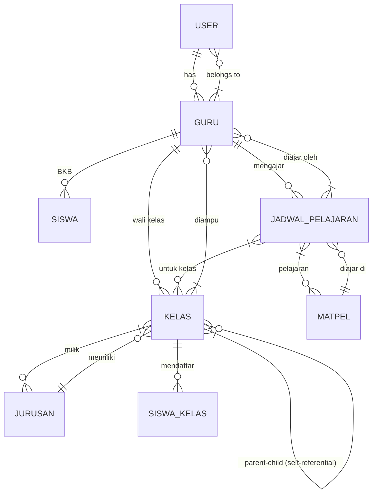

# IFSU CBT – Aplikasi Informasi Sekolah

Aplikasi manajemen jadwal mengajar berbasis **Laravel 12 + PostgreSQL** di backend dan **Inertia.js v3 + Svelte 5** di frontend.

---

## 1. Arsitektur & Tech Stack

| Layer       | Teknologi                                                                                 |
|-------------|-------------------------------------------------------------------------------------------|
| Backend     | Laravel 12, PHP 8.5, PostgreSQL 15                                                       |
| Frontend    | Svelte 5 + SvelteKit, Inertia.js v3 (SSR via Vite), sveltestrap v3 (Bootstrap 5)         |
| Build       | Bun (dev server), Vite, Laravel Mix legacy polyfill                                        |
| Auth        | Google OAuth via Laravel Socialite                                                        |
| Routing TS  | Wayfinder – generates typed TS functions di `resources/js/actions/` dan `resources/js/routes/` |
| Styling     | Bootstrap 5 utilities + Bootstrap Icons (`bi-*`), TailwindCDN-free                       |

---

## 2. Struktur Direktori

```
app/
├── Http/
│   ├── Controllers/           # Controller utama (non-admin)
│   ├── Controllers/Admin/     # Controller admin (Dashboard, Kelas, Matpel, Jurusan, Pengajar, TahunAjaran)
│   ├── Middleware/            # Auth, AdminOnly, AppOnly
│   ├── Requests/             # Form Request validation (jika ada)
│   └── Kernel.php            # Route middleware aliases
├── Models/                   # Eloquent models
├── Support/
│   └── Toast.php             # Flash message helper via Inertia
├── Providers/                # Service providers

bootstrap/                    # App bootstrapping
config/                       # Laravel + app config
database/
├── factories/                # Model factories (Breeze-style)
├── migrations/               # All migrations
├── seeders/                  # GuruSeeder, KelasSeeder, MatpelSeeder, JadwalPelajaranSeeder, dll.

resources/
├── js/
│   ├── actions/              # Auto-generated Wayfinder controller actions
│   ├── routes/               # Auto-generated Wayfinder route helpers
│   ├── components/
│   │   ├── Select.svelte     # Wrapper svelte-select
│   │   ├── TahunAjaranInfo.svelte
│   │   ├── ConfirmDialog.svelte
│   │   ├── IsRole.svelte
│   │   ├── CookieConsent.svelte
│   │   └── crud/CrudManager.svelte
│   ├── layouts/              # admin/AdminLayout.svelte, app/UserLayout.svelte
│   ├── pages/
│   │   ├── Login.svelte      # Guest view
│   │   ├── Dashboard.svelte  # Authenticated user home
│   │   ├── Matpel.svelte     # Guru's subjects
│   │   └── admin/
│   │       ├── Dashboard.svelte
│   │       ├── Kelas/
│   │       ├── Matpel/
│   │       ├── Jurusan/
│   │       ├── TahunAjaran/
│   │       ├── Pengajar/
│   │       └── AturJadwal/
│   │           └── Index.svelte  # Jadwal mengajar – main component
│   └── app.html              # Root HTML template
├── css/
│   └── app.css               # Bootstrap + custom CSS import
├── images/

routes/
├── web.php                   # Web routes (guest + auth)
├── admin.php                 # Admin sub-routes (loaded via web.php)
└── console.php               # Artisan commands

public/
├── build/                    # Vite build output (production)
└── assets/                   # Static assets

tests/
├── Feature/
├── Unit/
└── Pest.php                  # Pest config + helpers
```

---

## 3. Routing & Middleware

### 3.1 Routing Tree

**`routes/web.php`** – route utama:

| Route                | Middleware    | Controller                        | Keterangan                     |
|----------------------|---------------|------------------------------------|--------------------------------|
| `/login`             | `guest`       | `AuthenticatedSessionController`  | Login via Google               |
| `/app`               | `auth, app-only` | `DashboardController`          | User dashboard                 |
| `/app/matpel-saya`   | `auth, app-only` | `MataPelajaranGuruController`  | Daftar mata pelajaran guru     |
| `/admin/*`           | `auth, admin-only` | (semua di `routes/admin.php`)  | Admin panel                    |

**`routes/admin.php`** – dimuat via `Route::prefix("admin")->middleware(["auth","admin-only"])->group(base_path("routes/admin.php"))`:

| Route                                | Controller                       | Aksi                | Nama Route                    |
|--------------------------------------|----------------------------------|---------------------|-------------------------------|
| `admin/`                             | `Admin\DashboardController`     | index               | `admin.index`                 |
| `admin/kelas`                        | `Admin\KelasController`         | index, store, update, destroy | `admin.kelas.*`   |
| `admin/tahun-ajaran`                 | `Admin\TahunAjaranController`   | CRUD                | `admin.tahun-ajaran.*`        |
| `admin/jurusan`                      | `Admin\JurusanController`       | CRUD                | `admin.jurusan.*`             |
| `admin/matpel`                       | `Admin\MatpelController`        | CRUD                | `admin.matpel.*`              |
| `admin/pengajar`                     | `Admin\PengajarController`      | index, store, update, destroy | `admin.pengajar.*` |
| `admin/pengajar/atur-jadwal/{guru}` | `AturJadwalPengajarController`  | index               | `admin.pengajar.atur-jadwal`  |
| `admin/pengajar/atur-jadwal/{guru}` (POST) | `AturJadwalPengajarController` | store | `admin.pengajar.atur-jadwal.store` |
| `admin/pengajar/atur-jadwal/{guru}/{jadwal}` (PUT) | `AturJadwalPengajarController` | update | `admin.pengajar.atur-jadwal.update` |
| `admin/pengajar/atur-jadwal/{guru}/{jadwal}` (DELETE) | `AturJadwalPengajarController` | destroy | `admin.pengajar.atur-jadwal.destroy` |

### 3.2 Middleware

| Middleware   | Lokasi                         | Fungsi                                    |
|--------------|--------------------------------|-------------------------------------------|
| `auth`       | Laravel bawaan                  | Pastikan user sudah login                 |
| `admin-only` | `app/Http/Middleware/AdminOnlyMiddleware.php` | Redirect non-admin ke `/app` |
| `app-only`   | `app/Http/Middleware/AppOnlyMiddleware.php`   | Redirect non-user ke `/admin` |
| `guest`      | Laravel bawaan                  | Redirect user yang sudah login            |

---

## 4. Model & Relasi

### 4.1 User ↔ Guru

`User` memiliki `guru` (BelongsTo). Setiap `User` dapat memiliki satu `Guru`.



### 4.2 Daftar Model

| Model               | Tabel                 | Atribut Kunci                                                                                   |
|---------------------|-----------------------|------------------------------------------------------------------------------------------------|
| `User`              | `users`               | `id`, `name`, `email`, `password`, `guru_id`                                                   |
| `Guru`              | `gurus`               | `id`, `nip`, `nama_lengkap`, `pendidikan_terakhir`, `jenis_kelamin`, `alamat`, `foto_profil`, `is_aktif` |
| `Siswa`             | `siswas`              | `nisn`, `nama_lengkap`, `tanggal_lahir`, `jenis_kelamin`, `jurusan_id`                         |
| `SiswaKelas`        | `siswa_kelas`        | `id`, `siswa_nisn`, `kelas_id`                                                                  |
| `Kelas`             | `kelas`               | `id`, `nama`, `deskripsi`, `guru_id`, `active`, `parent_id`, `jurusan_id`, `ruangan`           |
| `Jurusan`           | `jurusans`            | `id`, `nama`, `kode`, `deskripsi`                                                              |
| `Matpel`            | `matpels`             | `id`, `name`, `description`                                                                    |
| `JadwalPelajaran`   | `jadwal_pelajarans`   | `id`, `guru_id`, `matpel_id`, `kelas_id`, `hari`, `jam_mulai`, `jam_selesai`                    |
| `TahunAjaran`       | `tahun_ajarans`      | `id`, `name`, `start_date`, `end_date`, `active`                                               |

### 4.3 Relasi Kelas (Self-Referential)

`Kelas` memiliki `parent_id` yang merujuk ke `Kelas` lain — ini merepresentasikan hierarki:
- **Parent** = tingkat/jenjang (misal: "X")
- **Leaf** = kelas aktual (misal: "X RPL 1")

Method `children()` dan `parent()` memungkinkan traversing hierarki.

---

## 5. Atur Jadwal Pengajar (`AturJadwalPengajarController`)

### 5.1 Routing

| HTTP Method | URI Pattern                                      | Controller Method | Nama Route                              |
|-------------|--------------------------------------------------|-------------------|-----------------------------------------|
| GET         | `/admin/pengajar/atur-jadwal/{guru_id}`         | `index`           | `admin.pengajar.atur-jadwal`            |
| POST        | `/admin/pengajar/atur-jadwal/{guru_id}`         | `store`           | `admin.pengajar.atur-jadwal.store`      |
| PUT         | `/admin/pengajar/atur-jadwal/{guru_id}/{jadwal}` | `update`          | `admin.pengajar.atur-jadwal.update`     |
| DELETE      | `/admin/pengajar/atur-jadwal/{guru_id}/{jadwal}` | `destroy`         | `admin.pengajar.atur-jadwal.destroy`    |

`{jadwal}` menggunakan **route-model binding** ke `JadwalPelajaran`.

### 5.2 Index — Menampilkan Data

Controller `index()`:

1. Mencari `Guru` dengan `findOrFail($guru_id)` (404 otomatis jika tidak ada).
2. Membuat array `$guruData` yang berisi `id`, `nama`, `nip`, `jabatan`, `walikelas` (array nama kelas), dan `foto`.
3. Mengambil semua jadwal untuk guru tersebut dengan eager-load `matpel` dan `kelas`.
4. Mengurutkan jadwal menggunakan `CASE` expression untuk hari (Minggu → Sabtu), kemudian `jam_mulai`.
5. Memetakan hasil ke array datar dengan field: `id`, `hari`, `matpel`, `matpel_id`, `kelas`, `kelas_id`, `jam_mulai`, `jam_selesai`, `ruangan`, `color`.
6. Mengambil opsi matpel via `Matpel::pluck('name', 'id')`.
7. Membangun opsi kelas hanya untuk **leaf classes** (kelas tanpa children) dengan hierarki path penuh.
8. Merender Inertia page `admin/AturJadwal/Index` dengan props: `guru`, `jadwal`, `matpelOptions`, `kelasOptions`.

#### PostgreSQL Time Ordering

```sql
CASE
    WHEN hari = 'Minggu' THEN 0
    WHEN hari = 'Senin' THEN 1
    ...
END
```

`FIELD()` MySQL tidak tersedia di PostgreSQL. `CASE` expression digunakan sebagai pengganti.

#### Leaf Class Options

`buildLeafKelasOptions()`:

1. Memuat semua `Kelas` dengan kolom `id`, `nama`, `parent_id`.
2. Menyaring kelas yang tidak memiliki anak (`! $all->contains('parent_id', $k->id)`).
3. Untuk setiap leaf, menelusuri ke parent secara rekursif untuk membangun path penuh (misal: "X / X RPL / X RPL 1").
4. Membalik array path dan menggabungkan dengan ` / `.

### 5.3 Store — Menambahkan Jadwal

Validasi:
- `matpel_id` – required, exists di tabel `matpels`
- `kelas_id` – required, exists di tabel `kelas`
- `hari` – required, string
- `jam_mulai` – required, format `H:i` (24-hour)
- `jam_selesai` – required, format `H:i`, harus setelah `jam_mulai`

Pengecekan duplikat (4 aturan):

| Aturan | Kondisi | Error Message |
|--------|---------|---------------|
| **Guru + Matpel + Hari** | Guru yang sama sudah mengajar matpel yang sama pada hari yang sama | *"Guru sudah mengajar mata pelajaran ini pada hari yang sama."* |
| **Kelas + Matpel** | Kelas yang sama sudah memiliki jadwal untuk matpel yang sama | *"Kelas sudah memiliki jadwal untuk mata pelajaran ini."* |
| **Kelas + Hari + Time Clash** (guru lain) | Guru lain sudah mengajar kelas yang sama pada hari & jam yang sama (overlap) | *"Jadwal bentrok: kelas {nama} sudah diajar oleh guru {nama} untuk {matpel} pada {hari}, {jam_mulai} - {jam_selesai}."* |
| **Guru + Hari + Time Clash** | Guru yang sama sudah mengajar kelas lain pada hari & jam yang sama (overlap) | *"Jadwal bentrok: guru ini sudah mengajar kelas {nama} untuk {matpel} pada {hari}, {jam_mulai} - {jam_selesai}."* |

Time overlap formula (PostgreSQL time comparison):
```php
->where('jam_mulai', '<', $newJamSelesai)
->where('jam_selesai', '>', $newJamMulai)
```

Jika lolos semua pengecekan, data disimpan ke `jadwal_pelajarans`.

### 5.4 Update — Memperbarui Jadwal

Sama seperti store, tetapi:
- Route-model binding memastikan `jadwal` milik `guru_id` yang sama.
- Semua pengecekan mengeksekusi `where('id', '!=', $jadwal->id)` untuk mengecualikan record yang sedang diedit.

### 5.5 Destroy — Menghapus Jadwal

- Route-model binding memastikan kepemilikan.
- `delete()` langsung.
- Toast: *"Jadwal berhasil dihapus."*

### 5.6 Helper Methods

| Method | Return | Fungsi |
|--------|--------|--------|
| `buildLeafKelasOptions()` | `array<string, string>` | ID → full hierarchy path (leaf only) |
| `duplicateGuruMatpel()` | `bool` | Cek guru + hari + matpel |
| `duplicateKelasMatpel()` | `bool` | Cek kelas + matpel |
| `timeClashKelas()` | `?JadwalPelajaran` | Cek time overlap untuk kelas (guru lain) — mengembalikan record yang bentrok |
| `timeClashGuru()` | `?JadwalPelajaran` | Cek time overlap untuk guru — mengembalikan record yang bentrok |
| `colorForMatpel()` | `string` | Generate Bootstrap color (warna legenda) |
| `validateJadwal()` | `array` | Shared validation rules |

### 5.7 Toast System

`App\Support\Toast` menggunakan `Inertia::flash('toast', [...])` untuk:
- `Toast::success('message')` → tipe `success`
- `Toast::error('message')` → tipe `error`
- `Toast::info('message')` → tipe `info`
- `Toast::warning('message')` → tipe `warning`

Flash data ini tersedia di client via `page.props.toast`.

---

## 6. Frontend – AturJadwal/Index.svelte

### Komponen

Komponen berada di `resources/js/pages/admin/AturJadwal/Index.svelte`.

### Props (dari Controller)

| Prop | Type | Keterangan |
|------|------|-----------|
| `guru` | `GuruProps \| null` | Data guru: `id`, `nama`, `nip`, `jabatan`, `walikelas[]`, `foto` |
| `jadwal` | `EventJadwal[] \| null` | Array jadwal dengan field lengkap |
| `matpelOptions` | `Record<string, string>` | Map `id → name` |
| `kelasOptions` | `Record<string, string>` | Map `id → hierarchy_path` |

### EventJadwal Type

```typescript
type EventJadwal = {
    id: number;
    hari: string;
    matpel: string;
    matpel_id: number;
    kelas: string;
    kelas_id: number;
    jam_mulai: string;  // "09:00" (24-hour, H:i)
    jam_selesai: string; // "10:30" (24-hour, H:i)
    ruangan: string;
    color: string;      // Bootstrap color class, e.g. "primary"
};
```

### Empty State

Jika `jadwal` kosong (`jadwalProps?.length ? jadwalProps : []`), komponen menampilkan:
```html
<Alert color="info">
    <i class="bi bi-info-circle"></i>
    <span>Tidak ada jadwal. Klik "Tambah Jadwal" untuk menambahkan.</span>
</Alert>
```

Mock data telah **dihapus** — komponen hanya menampilkan data asli dari backend.

### UI Elements

#### Guru Card
- Avatar dengan inisial (2 huruf pertama nama).
- Nama lengkap, NIP, jabatan.
- Badge "Wali Kelas X" untuk setiap kelas walikelas.
- Legend warna matpel (dari `colorForMatpel()`).

#### Jadwal Table (Compact Format)
Format satu baris sesuai permintaan:
```
Senin  | Matematika / X RPL 1  / 09:00 - 10:30
```
- Hari ditampilkan **bold** hanya pada baris pertama kelompok (colspan-style).
- Urutan: hari (Minggu → Sabtu), lalu `jam_mulai`.
- Kolom aksi: tombol **Edit** (buka modal) dan **Hapus** (konfirmasi).

#### Modal Form (Create/Edit)
Form menggunakan `useForm` dari Inertia.js:
- **Select** (svelte-select) untuk Matpel dan Kelas.
- **Native `<select>`** untuk Hari (Senin–Minggu).
- **`<Input type="time">`** untuk Jam Mulai dan Jam Selesai (24-hour format).
- Tombol **Batal** (tutup modal) dan **Simpan/Tambah** (submit form).
- Semua validasi error ditampilkan di bawah tiap field.

#### Validasi Waktu
- `jam_selesai` harus setelah `jam_mulai` (server-side: `after:jam_mulai`).
- Time clash detection (lihat §5.3).

---

## 7. Frontend Components

### 7.1 Select.svelte (`resources/js/components/Select.svelte`)

Wrapper di sekitar `svelte-select`:
- Props: `items`, `value`, `placeholder`, `multiple`, `searchable`, `clearable`, `disabled`, `hasError`, `invalid`, `size`, `class`.
- `onchange` – callback ketika nilai berubah.
- Custom snippet untuk chevron icon (`bi bi-chevron-down`).

### 7.2 VanillaDatePicker.svelte (`resources/js/components/DatePicker/VanillaDatePicker.svelte`)

React wrapper untuk `vanilla-calendar-pro`:
- **Prop**: `value`, `onchange`, `placeholder`, `label`, `disabled`, `dateMin`, `dateMax`, `selectionTimeMode` (default `24` — 24-hour format, tidak ada AM/PM).
- Inisialisasi `Calendar` instance dengan `onMount`, destroy otomatis saat unmount.
- Display value diformat ke locale Indonesia (`Sen, 15 Jan 2024`).
- Clear button (ikon `bi-x-lg`) untuk reset nilai.
- Calendar container disembunyikan (`display: none`) — muncul sebagai overlay ketika di-klik.

### 7.3 TahunAjaranInfo.svelte

Menampilkan tahun ajaran aktif:
- Jika ada: `<Alert color="success">` dengan nama tahun ajaran.
- Jika tidak: `<Alert color="warning">` dengan pesan "Belum ada Tahun Ajaran yang aktif."

### 7.4 ConfirmDialog.svelte

Dialog konfirmasi generik menggunakan sveltestrap Modal.

### 7.5 IsRole.svelte

Conditional rendering berdasarkan role user.

### 7.6 CookieConsent.svelte

Cookie consent banner menggunakan `svelte-cookie-consent`.

### 7.7 CrudManager.svelte

Generic CRUD manager untuk tabel admin.

---

## 8. Data Seeding

### Seeder Order (di `DatabaseSeeder`)

```
JurusanSeeder → KelasSeeder → GuruSeeder → MatpelSeeder → JadwalPelajaranSeeder
```

### JadwalPelajaranSeeder

- 7 hari (Senin–Minggu) × 5 time slots = 35 entries per guru.
- Menggunakan `GuruFactory`, `MatpelFactory`, `KelasFactory` untuk FK resolution.

---

## 9. Konvensi Pengembangan

### 9.1 Backend (PHP)

- **Curly braces wajib** untuk control structures.
- **PHP 8 constructor property promotion**.
- **Type hints & return types** pada semua method.
- **camelCase** untuk method/variabel non-constanta.
- **TitleCase** untuk Enum keys.
- **24-hour time format** (`H:i`) — tidak ada AM/PM.
- **PostgreSQL CASE** untuk ordered day-name sorting (bukan `FIELD()`).

### 9.2 Frontend (Svelte 5 + Inertia)

- **Svelte 5 runes**: `$state`, `$derived`, `$props`.
- **Inertia.js v3**: `useForm`, `router`, `usePage`.
- **Wayfinder**: import controller actions dari `@/actions/`.
- **sveltestrap v3**: Bootstrap 5 components.
- **Bootstrap Icons**: `<i class="bi bi-*">`.
- **Tailwind utilities** dipakai sesuai kebutuhan (dari CDN build).

### 9.3 Format Waktu

Semua input waktu menggunakan **format 24-hour (`H:i`)**:
- Frontend: `<input type="time" bind:value={form.jam_mulai}>`.
- Backend: `date_format:H:i` pada validation rules.
- Database: PostgreSQL `time` column type.

---

## 10. Penggunaan

### Development

```bash
composer run dev        # Laravel + Vite dev server
bun run dev            # Alternatif Vite dev
```

### Production Build

```bash
bun run build          # Vite production build
```

### Code Formatting

```bash
vendor/bin/pint --format agent        # PHP (Laravel Pint)
vendor/bin/pint --format agent --dirty # PHP (hanya file yang berubah)
```

### Tests

```bash
php artisan test --compact           # Semua tests
php artisan test --compact --filter=TestName
```

### Database

```bash
php artisan migrate:fresh --seed     # Fresh migrate + seed
php artisan db:seed                  # Seed only
php artisan wayfinder:generate       # Regenerate TS route actions
```

---

## 11. File Penting (Quick Reference)

| File | Deskripsi |
|------|-----------|
| `routes/web.php` | Web routes (guest, auth, admin prefix) |
| `routes/admin.php` | Admin sub-routes (dapat, kelas, matpel, jurusan, pengajar, atur-jadwal) |
| `app/Http/Controllers/AturJadwalPengajarController.php` | CRUD jadwal + validasi bentrok |
| `app/Models/JadwalPelajaran.php` | Model jadwal (fillable + belongsTo) |
| `app/Support/Toast.php` | Flash message helper |
| `resources/js/pages/admin/AturJadwal/Index.svelte` | Halaman jadwal mengajar (table + modal) |
| `resources/js/components/DatePicker/VanillaDatePicker.svelte` | Vanilla Calendar Pro — date picker component (24h, input mode) |
| `resources/js/actions/App/Http/Controllers/AturJadwalPengajarController.ts` | Wayfinder TS actions |
| `database/migrations/*_add_hari_to_jadwal_pelajarans_table.php` | Migration `hari` column |
| `database/factories/JadwalPelajaranFactory.php` | Factory jadwal |
| `database/seeders/JadwalPelajaranSeeder.php` | Seeder 35 entries |
