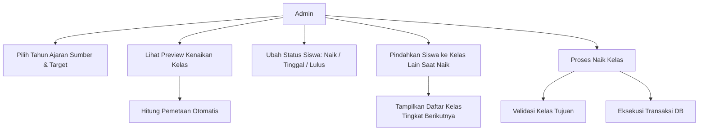
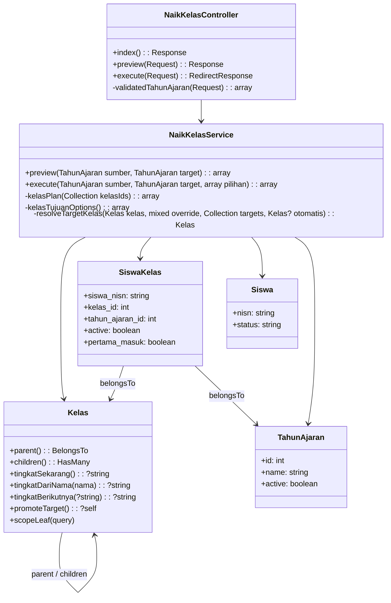
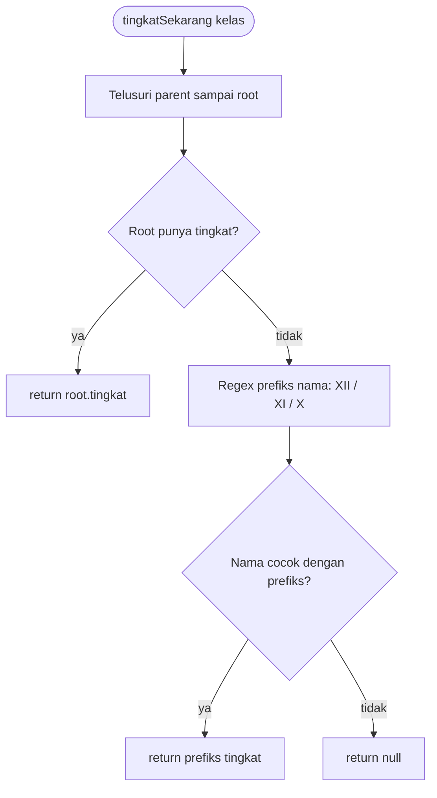

# Requirement Fitur Naik Kelas dengan Pemindahan ke Kelas Lain

## 1. Tujuan & Latar Belakang

Sistem naik kelas memindahkan seluruh peserta didik dari kelas sumber
(mis. `X-RPL-10`) ke kelas tujuan tingkat berikutnya (mis. `XI-RPL-10`)
pada tahun ajaran baru.

Kenyataan di lapangan: **tidak semua siswa naik ke kelas yang sama**.
Sebagian siswa (1–2 orang) bisa pindah ke rombongan lain di tingkat yang
sama (mis. `XI-RPL-9`, `XI-TKJ-1`), karena pertimbangan jumlah rombel,
pilihan jurusan, atau kebijakan sekolah.

Fitur ini menambahkan **override kelas tujuan per siswa** saat preview
naik kelas, tanpa menghilangkan pemetaan otomatis yang sudah ada:

- Status per siswa tetap: **Naik** / **Tinggal** / **Lulus**
- Siswa berstatus **Naik** boleh dipindahkan ke kelas tujuan pilihan
  admin (rombongan belajar aktif di tingkat berikutnya)
- Jika admin tidak memilih apa pun, sistem memakai **kelas tujuan
  otomatis** (pemetaan nama kelas, mis. `X-RPL-10` → `XI-RPL-10`)

## 2. Peran & Alur Singkat

### Admin

1. Pilih **Tahun Ajaran Sumber** (mis. 2025/2026) & **Tahun Ajaran
   Target** (mis. 2026/2027)
2. Klik **Lihat Preview** → sistem menghitung pemetaan otomatis tanpa
   menulis DB
3. Untuk setiap siswa, admin dapat:
   - Ubah **status**: Naik / Tinggal / Lulus
   - Bila **Naik**, pilih **Pindah ke Kelas** (rombongan tingkat
     berikutnya, dikelompokkan per jurusan). Default = kelas tujuan
     otomatis
4. Klik **Proses Naik Kelas** → eksekusi dalam satu transaksi DB

### Sistem

- Preview hanya membaca data (`siswa_kelas` aktif di TA sumber) dan
  menghitung rencana pemetaan
- Eksekusi menulis: `siswa_kelas` baru di TA target (aktif), menonaktifkan
  `siswa_kelas` lama di TA sumber, dan bila **Lulus** mengubah
  `siswa.status = 'lulus'`

## 3. Use Case Diagram



## 4. Activity Diagram (Alur Proses Naik Kelas)

```mermaid
flowchart TD
    START([Mulai]) --> P1{Pilih TA Sumber & Target}
    P1 -- beda --> PREV[Klik Lihat Preview]
    P1 -- sama --> ERR1[Toast Error: TA harus berbeda]
    ERR1 --> START

    PREV --> BACA[Baca siswa_kelas aktif di TA sumber<br/>hanya kelas rombel leaf]
    BACA --> HITUNG[Hitung per kelas asal:<br/>tingkat, kelas tujuan otomatis,<br/>daftar kelas tujuan tingkat berikutnya]
    HITUNG --> DEFAULT[Set status default:<br/>ada target -> Naik<br/>XII -> Lulus<br/>lainnya -> Tinggal]
    DEFAULT --> TAMPIL[Tampilkan tabel per kelas asal]

    TAMPIL --> ADM{Admin ubah per siswa?}
    ADM -- status --> SET[Set Naik / Tinggal / Lulus]
    ADM -- naik --> TARGET[Pilih Pindah ke Kelas]
    ADM -- selesai --> PROSES[Klik Proses Naik Kelas]

    PROSES --> VAL{Validasi semua pilihan}
    VAL -- kelas tujuan bukan<br/>tingkat berikutnya --> ERR2[ValidationException<br/>transaksi dibatalkan]
    ERR2 --> TAMPIL
    VAL -- valid --> TX[Transaksi DB]

    TX --> LOOP{Untuk setiap siswa}
    LOOP -- Lulus --> LULUS[siswa.status = lulus<br/>siswa_kelas sumber dinonaktifkan]
    LOOP -- Tinggal --> TINGGAL[siswa_kelas target = kelas asal<br/>siswa_kelas sumber dinonaktifkan]
    LOOP -- Naik --> NAIK{Kelas tujuan dipilih admin?}
    NAIK -- ya --> OVR[target = kelas pilihan admin]
    NAIK -- tidak --> AUTO[target = kelas tujuan otomatis<br/>atau kelas asal bila tidak ada]
    OVR --> TULIS[updateOrCreate siswa_kelas di TA target (aktif)]
    AUTO --> TULIS
    TINGGAL --> TULIS
    LULUS --> LOOP

    LOOP -- selesai --> TOAST[Toast sukses + ringkasan]
    TOAST --> FIN([Selesai])
```

## 5. Class Diagram



## 6. Sequence Diagram (Eksekusi Naik Kelas)

```mermaid
sequenceDiagram
    participant A as Admin (Frontend)
    participant C as NaikKelasController
    participant S as NaikKelasService
    participant DB as Database

    A->>C: POST /admin/naik-kelas/preview (sumber, target)
    C->>S: preview(sumber, target)
    S->>DB: SELECT siswa_kelas aktif TA sumber (kelas leaf)
    S->>DB: SELECT kelas tujuan per tingkat (leaf + jurusan)
    S-->>C: rencana pemetaan + kelas_tujuan + ringkasan
    C-->>A: Inertia render Index (preview)

    A->>A: Admin ubah status / pilih kelas tujuan per siswa
    A->>C: POST /admin/naik-kelas (pilihan[] dengan kelas_target)
    C->>C: validasi request (status in:naik,tinggal,lulus; kelas_target exists)
    C->>S: execute(sumber, target, pilihan)
    S->>DB: BEGIN TRANSACTION
    loop per pilihan siswa
        S->>S: resolveTargetKelas(kelas, kelas_target, targets, otomatis)
        alt kelas_target valid (leaf, tingkat berikutnya)
            S->>DB: updateOrCreate siswa_kelas (target TA, aktif)
        else kelas_target tidak valid
            S-->>A: ValidationException (rollback)
        end
        alt status lulus
            S->>DB: UPDATE siswa SET status = lulus
        end
        S->>DB: UPDATE siswa_kelas sumber SET active = false
    end
    S->>DB: COMMIT
    S-->>C: ringkasan (naik, tinggal, lulus)
    C-->>A: Toast sukses + redirect index
```

## 7. Alur Logika Detail

### 7.1 Preview (tanpa menulis DB)

1. Ambil semua `siswa_kelas` di TA sumber dengan `active = true` dan
   `kelas_id` berupa kelas **leaf** (rombel tanpa anak).
2. Kelompokkan per `kelas_id`.
3. Untuk setiap kelas asal:
   - `tingkat` = tingkat root (X / XI / XII) dari rantai `parent`;
     bila root tidak memiliki tingkat, dipakai **prefiks nama kelas**
     (lihat §9 Perbaikan Klasifikasi Tingkat)
   - `target otomatis` = `promoteTarget()`: ganti awalan tingkat pada
     nama kelas (X-RPL-10 → XI-RPL-10), cari kelas dengan nama itu
   - `status default`:
     - target otomatis ada → **naik**
     - tidak ada & tingkat XII → **lulus**
     - selainnya → **tinggal**
4. `kelas_tujuan` (opsi dropdown per siswa): semua kelas leaf yang
   tingkatnya = **tingkat berikutnya** dari tingkat sumber, diurutkan
   per jurusan lalu nama. Kunci array = tingkat sumber (`X`, `XI`).
5. Ringkasan dihitung dari status default seluruh siswa.

### 7.2 Eksekusi (satu transaksi DB)

Untuk setiap pilihan siswa `{ nisn, status, kelas_target? }`:

| Status | Kelas tujuan | Tindakan |
|---|---|---|
| `lulus` | diabaikan | `siswa.status = 'lulus'`, `siswa_kelas` sumber dinonaktifkan |
| `tinggal` | diabaikan | `siswa_kelas` target = **kelas asal**, sumber dinonaktifkan |
| `naik` | `kelas_target` dipilih | target = kelas pilihan, **wajib** leaf & tingkat berikutnya |
| `naik` | `kelas_target` kosong | target = kelas tujuan otomatis; bila tidak ada → kelas asal |

Aturan penting:

- `updateOrCreate` per `(siswa_nisn, kelas_id, tahun_ajaran_id)` membuat
  proses **idempoten** — menjalankan ulang tidak menggandakan data.
- `kelas_target` tidak valid (bukan leaf / tingkat tidak sesuai) →
  `ValidationException`, **seluruh transaksi di-rollback**.
- `kelas_target` diabaikan untuk status `tinggal`/`lulus`.
- Semua siswa baru di TA target dibuat `active = true`,
  `pertama_masuk = false`.

## 8. Skema Database Terkait

### `siswa_kelas` (jembatan siswa ↔ kelas per tahun ajaran)

| kolom | tipe | keterangan |
|---|---|---|
| id | bigint PK | |
| siswa_nisn | string FK → `siswa.nisn` | |
| kelas_id | bigint FK → `kelas.id` | kelas **leaf** (rombel) |
| tahun_ajaran_id | bigint FK → `tahun_ajaran.id` | |
| active | boolean | nonaktif = riwayat lama |
| pertama_masuk | boolean | siswa baru masuk |

### `kelas` (hierarki 3 level: root tingkat → jurusan → rombel leaf)

| kolom | tipe | keterangan |
|---|---|---|
| id | bigint PK | |
| nama | string | `X-RPL-10`, `XI-RPL-10` |
| tingkat | string nullable | hanya root (`X`, `XI`, `XII`) |
| parent_id | bigint FK → `kelas.id` nullable | rantai ke root |
| jurusan_id | bigint FK → `jurusan.id` nullable | |
| active | boolean | |

### `siswa`

| kolom | tipe | keterangan |
|---|---|---|
| nisn | string PK | |
| status | string | `aktif` / `lulus` (diubah saat naik kelas) |

Tidak ada perubahan skema untuk fitur ini — cukup logika service dan
tampilan preview.

## 9. Perbaikan: Klasifikasi Tingkat Saat Root Kelas Tidak Lengkap

### 9.1 Masalah yang Ditemukan

Saat diuji dengan data riil, pilihan **Pindah ke Kelas** menampilkan
kelas yang tidak sesuai (kelas tujuan tidak terklasifikasi ke tingkat
yang benar). Penelusuran menemukan akar masalah di **data**, bukan di
tampilan:

Data kelas di DB (hanya root, `parent_id IS NULL`):

| id | nama | tingkat | keterangan |
|---|---|---|---|
| 1 | X | X | benar |
| 30 | XII | XII | benar |
| 37 | XI | **NULL** | salah / tidak lengkap |

Root `XI` tidak memiliki nilai `tingkat`, padahal root `X` dan `XII`
memilikinya.

### 9.2 Akar Penyebab

Kode lama `Kelas::tingkatSekarang()` hanya menelusuri rantai `parent`
sampai root lalu membaca `root->tingkat`:

```
kelas "XI-RPL-1" → parent "XI-RPL" → parent "XI" (root, tingkat = NULL)
```

Karena root `XI` ber-`tingkat` NULL, **seluruh kelas XI** (XI-RPL-1
sampai XI-RPL-6) terdeteksi tingkat `null`. Dampaknya pada fitur naik
kelas:

1. Opsi kelas tujuan dikelompokkan per tingkat sumber — kelas XI yang
   tidak terklasifikasi tidak pernah masuk daftar `kelas_tujuan`,
   sehingga pilihan yang tampil salah/tidak sesuai.
2. Target otomatis (`promoteTarget`) dan status default untuk siswa XI
   ikut rusak (tingkat dianggap tidak ada).

### 9.3 Solusi

Dua perbaikan yang dilakukan:

**a) Perbaikan kode — fallback ke prefiks nama** (`app/Models/Kelas.php`):

- Tambah method statis `Kelas::tingkatDariNama(string $nama): ?string`
  yang mengekstrak tingkat dari **prefiks nama kelas** (konvensi
  penamaan `X-RPL-1`, `XI-RPL-1`, `XII-RPL-1`) dengan regex
  `^(XII|XI|X)(?=[\s-]|$)`:
  - urutan alternation **XII → XI → X** (paling panjang dulu) agar
    `XII-...` tidak salah terbaca sebagai `XI`
  - pembatas `[\s-]` atau akhir string agar nama `AXIO` tidak ikut
    terbaca
- `tingkatSekarang()` diubah: tetap baca tingkat root, dan **bila NULL
  (atau kosong) fallback ke `tingkatDariNama()`** dari nama kelas itu
  sendiri:

```
tingkatSekarang() {
    naik ke root melalui parent
    root->tingkat ada ?  → return root->tingkat
    tidak ada           → return tingkatDariNama(nama kelas)
}
```

**b) Perbaikan data — normalisasi sekali jalan**:

- Root `XI` (id 37) di-update menjadi `tingkat = 'XI'`, sehingga root
  X, XI, XII semuanya konsisten. Perbaikan kode di atas tetap
  diperlukan sebagai pengaman bila data serupa muncul lagi di
  kemudian hari.

### 9.4 Alur Logika Baru



Contoh pada data riil:

| Kelas | Root (tingkat) | Hasil sebelum fix | Hasil setelah fix |
|---|---|---|---|
| X RPL 5 | X (X) | X | X |
| XI-RPL-1 | XI (**NULL**) | **null** | **XI** (fallback nama) |
| XII-RPL-1 | XII (XII) | XII | XII |

### 9.5 Test Regresi

Dua test ditambahkan di `tests/Feature/NaikKelasTest.php` yang
meniru struktur data riil (root XI tanpa tingkat):

- `tingkatSekarang memakai nama saat root tidak punya tingkat` —
  kelas `XI-RPL-1` di bawah root `XI` (tingkat null) harus tetap
  terdeteksi `XI`, dan `tingkatBerikutnya()` mengembalikan `XII`.
- `preview kelas tujuan tidak menampilkan kelas asal saat root XI
  tingkat null` — preview naik kelas dari X harus menyediakan opsi
  kelas tujuan berisi kelas XI (bukan kelas asal X), dan
  `kelas_target_id` mengarah ke kelas XI.