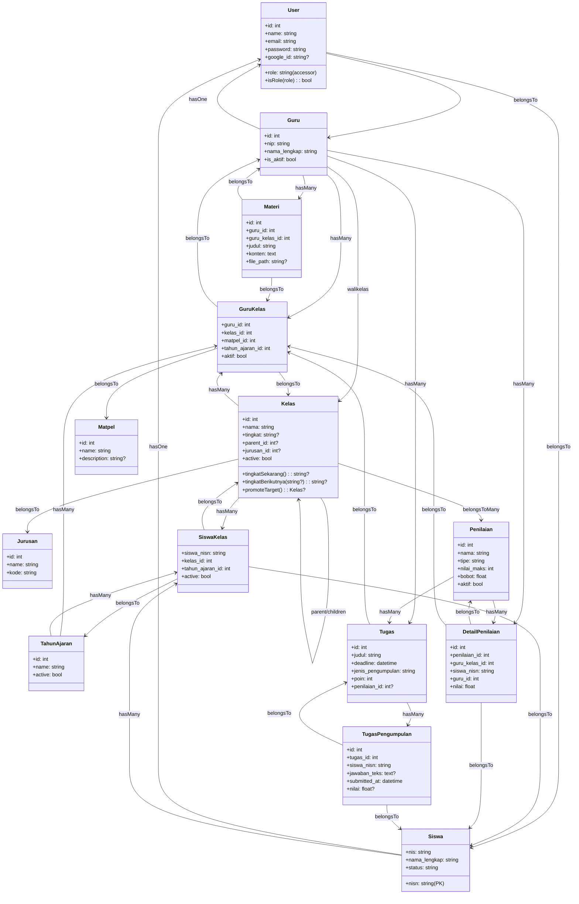
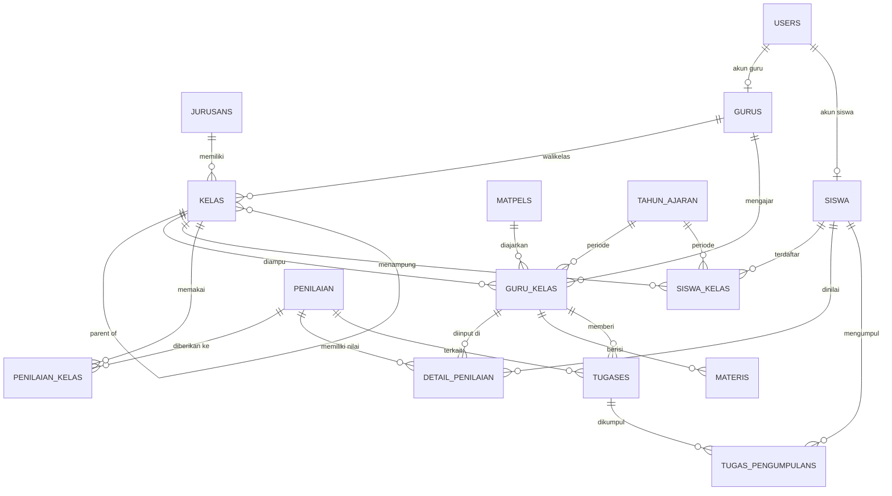

# Bahan UML — Aplikasi E-Learning SMK IFSU (CBT)

> Bahan siap pakai untuk menggambar diagram UML seluruh aplikasi (laporan KP
> & bahan belajar): setiap elemen diagram dirinci dalam tabel, dilengkapi
> Mermaid sebagai pratinjau. Untuk fitur naik kelas yang lebih rinci lihat
> `UML-NAIK-KELAS.md` dan `REQUIREMENTS-NAIK-KELAS.md`.

---

## 1. Gambaran Umum Aplikasi

### 1.1 Tujuan

Aplikasi E-Learning berbasis web untuk SMK IFSU: pusat kegiatan belajar
mengajar secara digital — **materi, tugas & pengumpulan, penilaian,
manajemen kelas, dan kenaikan kelas** — dengan tiga peran pengguna
(Admin, Guru, Siswa).

### 1.2 Aktor

| ID | Aktor | Keterangan |
|---|---|---|
| A1 | Admin | Mengelola data master (kelas, jurusan, mata pelajaran, tahun ajaran, siswa, pengajar), akun, penugasan guru–kelas–mapel, penilaian, dan kenaikan kelas. |
| A2 | Guru | Mengajar kelas: mengunggah materi, membuat tugas & menilai pengumpulan, menginput nilai, melihat rekap. |
| A3 | Siswa | Belajar: melihat materi, mengunduh/melihat berkas, mengumpulkan tugas, melihat nilai. |
| A4 | Sistem | Pendukung: otentikasi, perhitungan, validasi, penyimpanan berkas. |

### 1.3 Teknologi (Tech Stack)

| Lapisan | Teknologi |
|---|---|
| Backend | PHP 8.5, Laravel 13, Eloquent ORM |
| Database | PostgreSQL (pgsql) |
| Frontend | Inertia.js v3 + Svelte 5, TypeScript, Tailwind CSS 4, Bootstrap 5 (Sveltestrap) |
| Build | Vite 8 + `@inertiajs/vite`, Laravel Wayfinder (fungsi route ter-typed) |
| Otentikasi | Session Laravel + **Google OAuth (Socialite)** sebagai opsi login |
| Lainnya | ECharts (grafik), Tiptap (editor), pdfjs/docx/pptx/xlsx preview, Pest 5 (testing), Laravel Pint & Larastan (kualitas kode) |

### 1.4 Arsitektur & Alur Request

```
Browser (Svelte SPA)
   │  Inertia (visits, form, props)
   ▼
Laravel Router (routes/web.php + routes/admin.php)
   │  Middleware: guest | auth | app-only | admin-only
   ▼
Controller (App\Http\Controllers\*)
   │  Eloquent / Service (NaikKelasService)
   ▼
PostgreSQL
```

- Semua halaman di-render oleh Inertia (`Inertia::render`) dari controller.
- Tidak ada route API terpisah (bukan arsitektur API murni — server-rendered SPA).
- Route dibagi: publik (login), area **`/app/*`** (guru + siswa, middleware `app-only`), area **`/admin/*`** (admin, middleware `admin-only`).

### 1.5 Struktur Modul

| Modul | Pemilik | Ringkas |
|---|---|---|
| Autentikasi & Akun | Semua | Login email/password + Google OAuth, logout |
| Dashboard | Semua | Ringkasan sesuai peran |
| Data Master | Admin | Kelas (hierarki), Jurusan, Mata Pelajaran, Tahun Ajaran, Siswa, Pengajar (Guru) |
| Penugasan Guru–Kelas | Admin | Menetapkan guru mengajar kelas+mapel pada tahun ajaran (GuruKelas) |
| Penempatan Siswa | Admin | Mendaftarkan siswa ke rombel per tahun ajaran (SiswaKelas) |
| Akun Pengguna | Admin | Buat/ubah akun login untuk admin, guru, siswa |
| Materi | Guru & Siswa | Guru unggah materi; katalog & salin ke kelas lain; siswa lihat/unduh |
| Tugas | Guru & Siswa | Guru buat tugas (teks/file, deadline, poin); siswa kumpul (teks/file); guru nilai |
| Penilaian | Admin & Guru & Siswa | Admin definisikan komponen nilai; guru input nilai & rekap; siswa lihat nilai |
| Naik Kelas | Admin | Preview & proses kenaikan kelas per tahun ajaran (detail di dokumen terpisah) |

---

## 2. Use Case Diagram

### 2.1 Daftar Use Case

| ID | Use Case | Aktor | Modul |
|---|---|---|---|
| UC-01 | Login | A1, A2, A3 | Autentikasi |
| UC-02 | Login dengan Google | A1, A2, A3 | Autentikasi |
| UC-03 | Logout | A1, A2, A3 | Autentikasi |
| UC-04 | Lihat Dashboard | A1, A2, A3 | Dashboard |
| UC-05 | Kelola Kelas (hierarki) | A1 | Data Master |
| UC-06 | Kelola Jurusan | A1 | Data Master |
| UC-07 | Kelola Mata Pelajaran | A1 | Data Master |
| UC-08 | Kelola Tahun Ajaran | A1 | Data Master |
| UC-09 | Kelola Data Siswa | A1 | Data Master |
| UC-10 | Kelola Data Pengajar (Guru) | A1 | Data Master |
| UC-11 | Atur Penugasan Guru–Kelas–Mapel | A1 | Penugasan |
| UC-12 | Atur Penempatan Siswa ke Kelas | A1 | Penempatan |
| UC-13 | Kelola Akun Admin/Guru/Siswa | A1 | Akun |
| UC-14 | Kelola Komponen Penilaian | A1 | Penilaian |
| UC-15 | Lihat Detail & Input Nilai (admin) | A1 | Penilaian |
| UC-16 | Preview & Proses Naik Kelas | A1 | Naik Kelas |
| UC-17 | Kelola Materi | A2 | Materi |
| UC-18 | Salin Materi ke Kelas Lain | A2 | Materi |
| UC-19 | Kelola Tugas | A2 | Tugas |
| UC-20 | Nilai Pengumpulan Tugas | A2 | Tugas |
| UC-21 | Input Nilai & Lihat Rekap | A2 | Penilaian |
| UC-22 | Lihat Materi | A3 | Materi |
| UC-23 | Lihat & Kumpulkan Tugas | A3 | Tugas |
| UC-24 | Lihat Nilai | A3 | Penilaian |
| UC-25 | Manajemen Kelas (ruang kelas virtual) | A2 | Kelas |

### 2.2 Relasi include / extend

- `UC-01` —include→ verifikasi kredensial (Sistem)
- `UC-02` —extend→ `UC-01` (opsional)
- `UC-16` —include→ hitung pemetaan otomatis & validasi kelas tujuan (detail di `UML-NAIK-KELAS.md` §1)
- `UC-18` —include→ pilih materi dari katalog kelas lain
- `UC-21` —include→ hitung rata-rata/predikat nilai
- `UC-23` —include→ cek deadline tugas
- Semua `Kelola/Ubah` —include→ validasi input (Sistem)

### 2.3 Mermaid (pratinjau global)

```mermaid
graph TD
    A[Admin] --> UC5[Kelola Kelas]
    A --> UC6[Kelola Jurusan]
    A --> UC7[Kelola Mata Pelajaran]
    A --> UC8[Kelola Tahun Ajaran]
    A --> UC9[Kelola Data Siswa]
    A --> UC10[Kelola Data Pengajar]
    A --> UC11[Atur Penugasan Guru-Kelas]
    A --> UC12[Atur Penempatan Siswa]
    A --> UC13[Kelola Akun Pengguna]
    A --> UC14[Kelola Komponen Penilaian]
    A --> UC15[Lihat Detail & Input Nilai]
    A --> UC16[Preview & Proses Naik Kelas]
    A --> UC01[Login]

    G[Guru] --> UC04[Lihat Dashboard]
    G --> UC17[Kelola Materi]
    G --> UC18[Salin Materi ke Kelas Lain]
    G --> UC19[Kelola Tugas]
    G --> UC20[Nilai Pengumpulan Tugas]
    G --> UC21[Input Nilai & Rekap]
    G --> UC25[Manajemen Kelas]
    G --> UC01

    S[Siswa] --> UC04
    S --> UC22[Lihat Materi]
    S --> UC23[Lihat & Kumpulkan Tugas]
    S --> UC24[Lihat Nilai]
    S --> UC01

    UC16 -. include .-> UC16b[Hitung Pemetaan Otomatis]
    UC21 -. include .-> UC21b[Hitung Rata-rata & Predikat]
    UC23 -. include .-> UC23b[Cek Deadline]
    UC02 -. extend .-> UC01
```



---

## 3. Activity Diagram

### 3.1 Autentikasi (Login + Google OAuth)

| # | Tipe | Node | Keterangan |
|---|---|---|---|
| 1 | Start | Mulai | — |
| 2 | Action | Buka halaman login | — |
| 3 | Decision | Pilih metode? | [email] → 4; [Google] → 6 |
| 4 | Action | Isi email & password | — |
| 5 | Decision | Kredensial valid? | [tidak] → error kembali ke 2; [ya] → 8 |
| 6 | Action | Redirect ke Google (OAuth) | Socialite |
| 7 | Action | Callback + verifikasi email Google | cocokkan dengan User (`google_id`) |
| 8 | Decision | Peran pengguna? | admin → Dashboard Admin; guru/siswa → App (dashboard) |
| 9 | End | Masuk ke aplikasi | — |

### 3.2 Alur Umum Guru — Materi & Tugas

| # | Tipe | Node | Keterangan |
|---|---|---|---|
| 1 | Action | Buka menu Materi / Tugas | — |
| 2 | Action | Isi form (judul, deskripsi, berkas/teks, deadline) | — |
| 3 | Decision | Validasi form lolos? | [tidak] → kembali; [ya] → 4 |
| 4 | Action | Simpan (upload berkas ke storage) | — |
| 5 | Action | Tampilkan daftar | — |
| 6 | Decision | Perlu bagikan ke kelas lain? | [ya] → 7 (salin ke guru_kelas lain) |
| 7 | Action | Pilih kelas tujuan katalog & salin | — |

### 3.3 Alur Umum Guru — Input Penilaian

| # | Tipe | Node | Keterangan |
|---|---|---|---|
| 1 | Action | Pilih penilaian & kelas (penugasan) | — |
| 2 | Action | Isi nilai per siswa | — |
| 3 | Decision | Nilai ≤ nilai_maks? | [tidak] → koreksi; [ya] → 4 |
| 4 | Action | Simpan DetailPenilaian (updateOrCreate) | idempoten |
| 5 | Action | Lihat rekap (rata-rata, predikat) | — |

### 3.4 Alur Umum Siswa — Kumpulkan Tugas

| # | Tipe | Node | Keterangan |
|---|---|---|---|
| 1 | Action | Buka daftar tugas | — |
| 2 | Action | Buka detail tugas | — |
| 3 | Decision | Masih dalam deadline? | [tidak] → hanya lihat; [ya] → 4 |
| 4 | Decision | Jenis pengumpulan? | teks / berkas |
| 5 | Action | Tulis jawaban / unggah berkas | — |
| 6 | Action | Kirim (simpan TugasPengumpulan) | — |

### 3.5 Naik Kelas

Ringkas: pilih TA → preview → ubah status/pindah kelas per siswa → proses dalam 1 transaksi.
**Detail lengkap (node per node + flowchart) ada di `UML-NAIK-KELAS.md` §2.**

---

## 4. Class Diagram

### 4.1 Model & atribut kunci

| Model (tabel) | Atribut utama |
|---|---|
| **User** (`users`) | id, name, email, password, google_id, role (accessor), is_admin; relasi ke Guru & Siswa |
| **Guru** (`gurus`) | id, nip, nama_lengkap, pendidikan_terakhir, jenis_kelamin, alamat, is_aktif |
| **Siswa** (`siswa`) | nisn (PK), nis, nama_lengkap, tempat_lahir, tanggal_lahir, jenis_kelamin, alamat, status |
| **Kelas** (`kelas`) | id, nama, tingkat, deskripsi, guru_id (walikelas), parent_id (self), jurusan_id, active |
| **Jurusan** (`jurusans`) | id, name, kode |
| **Matpel** (`matpels`) | id, name, description |
| **TahunAjaran** (`tahun_ajaran`) | id, name, active |
| **SiswaKelas** (`siswa_kelas`) | id, siswa_nisn, kelas_id, tahun_ajaran_id, active, pertama_masuk |
| **GuruKelas** (`guru_kelas`) | id, guru_id, kelas_id, matpel_id, tahun_ajaran_id, aktif |
| **Penilaian** (`penilaian`) | id, nama, deskripsi, tipe, nilai_maks, bobot, aktif, sumber |
| **DetailPenilaian** (`detail_penilaian`) | id, penilaian_id, guru_kelas_id, tahun_ajaran_id, siswa_nisn, guru_id, nilai, sumber, keterangan |
| **Materi** (`materis`) | id, guru_id, guru_kelas_id, judul, deskripsi, konten, file_path, file_name, file_size, mime_type |
| **Tugas** (`tugases`) | id, guru_id, guru_kelas_id, judul, deskripsi, tanggal_terbit, deadline, jenis_pengumpulan, poin, file_*, penilaian_id |
| **TugasPengumpulan** (`tugas_pengumpulans`) | id, tugas_id, siswa_nisn, file_*, jawaban_teks, submitted_at, nilai |

### 4.2 Relasi antar model

| Dari | Ke | Tipe | Melalui |
|---|---|---|---|
| User | Guru / Siswa | belongsTo | guru_id / nisn |
| Guru | User | hasOne | guru_id |
| Guru | Kelas (walikelas) | hasMany | guru_id |
| Guru | GuruKelas | hasMany | guru_id |
| Guru | Kelas (mengajar) | hasManyThrough | GuruKelas |
| Guru | Materi / Tugas / DetailPenilaian | hasMany | guru_id |
| Siswa | User | hasOne | nisn |
| Siswa | SiswaKelas | hasMany | siswa_nisn |
| Siswa | Kelas | hasOneThrough | SiswaKelas (active) |
| Kelas | Kelas (parent/children) | self belongsTo/hasMany | parent_id |
| Kelas | Jurusan | belongsTo | jurusan_id |
| Kelas | Guru (walikelas) | belongsTo | guru_id |
| Kelas | GuruKelas | hasMany | kelas_id |
| Kelas | SiswaKelas | hasMany | kelas_id |
| Kelas | Siswa | hasManyThrough | SiswaKelas |
| Kelas | Penilaian | belongsToMany | pivot `penilaian_kelas` |
| Jurusan | Kelas | hasMany | jurusan_id |
| TahunAjaran | GuruKelas / SiswaKelas / DetailPenilaian | hasMany | tahun_ajaran_id |
| SiswaKelas | Siswa / Kelas / TahunAjaran | belongsTo | — |
| GuruKelas | Guru / Kelas / Matpel / TahunAjaran | belongsTo | — |
| Penilaian | Kelas | belongsToMany | pivot `penilaian_kelas` |
| Penilaian | DetailPenilaian | hasMany | penilaian_id |
| Penilaian | Tugas | hasMany | penilaian_id |
| DetailPenilaian | Penilaian / GuruKelas / TahunAjaran / Siswa / Guru | belongsTo | — |
| Materi | Guru / GuruKelas | belongsTo | — |
| Tugas | Guru / GuruKelas / Penilaian | belongsTo | — |
| Tugas | TugasPengumpulan | hasMany | tugas_id |
| TugasPengumpulan | Tugas / Siswa | belongsTo | — |

### 4.3 Mermaid (pratinjau — inti)



### 4.4 Lapisan Kontroller (representasi)

| Kontroller | Area | Fungsi utama |
|---|---|---|
| `AuthenticatedSessionController` | publik | login (form + submit), logout |
| `SocialiteController` | publik | redirect & callback Google OAuth |
| `DashboardController` | app | dashboard bersama |
| `Guru\*Controller` (DashboardGuru, Materi, Tugas, Penilaian) | app/guru | fitur guru |
| `Siswa\*Controller` (Materi, Tugas, Penilaian) | app/siswa | fitur siswa |
| `MataPelajaranGuruController`, `KelasController` | app | matpel-saya & ruang kelas |
| `LinkExternalController` | publik | buka link eksternal |
| `Admin\*Controller` (dashboard, master data, akun, penilaian, naik kelas, dll) | admin | fitur admin |
| `NaikKelasService` | service | logika bisnis naik kelas |

---

## 5. Sequence Diagram

### 5.1 Login (email + password)

| Urut | Pengirim | Penerima | Pesan |
|---|---|---|---|
| 1 | User | Browser | isi email & password |
| 2 | Browser | AuthenticatedSessionController | POST /login |
| 3 | C | Auth | cek kredensial |
| 4 | C | DB | SELECT users WHERE email |
| 5 | Auth | C | verifikasi password (hash) |
| 6 | C | Session | mulai sesi + redirect |
| 7 | C | Browser | redirect ke dashboard sesuai peran |

### 5.2 Login Google (Socialite)

| Urut | Pengirim | Penerima | Pesan |
|---|---|---|---|
| 1 | Browser | SocialiteController | GET /auth/google/redirect |
| 2 | C | Google | redirect OAuth |
| 3 | Google | Browser | tampilkan halaman consent |
| 4 | Browser | SocialiteController | GET /auth/google/callback (code) |
| 5 | C | Google | tukar code → token & profil |
| 6 | C | DB | cari / buat User (google_id) |
| 7 | C | Browser | login & redirect |

### 5.3 Guru — Input Nilai

| Urut | Pengirim | Penerima | Pesan |
|---|---|---|---|
| 1 | Guru | Guru\PenilaianController | buka halaman penilaian |
| 2 | C | DB | SELECT penilaian + guru_kelas (penugasan) |
| 3 | Guru | C | isi nilai per siswa → POST store |
| 4 | C | DB | updateOrCreate DetailPenilaian (penilaian_id, guru_kelas_id, siswa_nisn) |
| 5 | C | Guru | toast sukses + tabel nilai terbaru |

### 5.4 Siswa — Kumpulkan Tugas

| Urut | Pengirim | Penerima | Pesan |
|---|---|---|---|
| 1 | Siswa | Siswa\TugasController | buka detail tugas |
| 2 | C | DB | SELECT tugas + status pengumpulan siswa |
| 3 | Siswa | C | POST /app/tugas/{tugas}/kumpul (teks/berkas) |
| 4 | C | DB | simpan / update TugasPengumpulan |
| 5 | C | Siswa | toast sukses + status "sudah dikumpul" |

### 5.5 Admin — Naik Kelas

Detail lengkap di `UML-NAIK-KELAS.md` §4 (preview 8 pesan, eksekusi 15 pesan).

---

## 6. State Diagram

### 6.1 Peran User

| State | Transisi |
|---|---|
| `admin` | dari DB `role='admin'` |
| `guru` | diturunkan dari relasi Guru |
| `siswa` | diturunkan dari relasi Siswa |
| `false` (tidak punya akses) | tanpa relasi Guru/Siswa & bukan admin |

### 6.2 `siswa.status`

`aktif` → `lulus` (saat diproses naik kelas berstatus Lulus) — lihat `UML-NAIK-KELAS.md` §5.

### 6.3 Siklus data per tahun ajaran

| Entitas | Transisi |
|---|---|
| `siswa_kelas.active` | true (TA aktif) → false (naik kelas / dipindah) |
| `guru_kelas.aktif` | true → false (penugasan dinonaktifkan) |
| `penilaian.aktif` | true → false (komponen dinonaktifkan) |
| `tahun_ajaran.active` | hanya satu aktif; yang lain nonaktif |

---

## 7. ERD (Database Lengkap)

### 7.1 Daftar tabel & kunci

| Tabel | PK | FK | Keterangan |
|---|---|---|---|
| users | id | guru_id → gurus, nisn → siswa | akun login |
| gurus | id | — | data guru |
| siswa | nisn | — | data siswa |
| jurusans | id | — | jurusan |
| matpels | id | — | mata pelajaran |
| tahun_ajaran | id | — | periode akademik |
| kelas | id | parent_id → kelas (self), jurusan_id → jurusans, guru_id → gurus | hierarki 3 level |
| siswa_kelas | id | siswa_nisn → siswa, kelas_id → kelas, tahun_ajaran_id → tahun_ajaran | pivot siswa↔kelas |
| guru_kelas | id | guru_id → gurus, kelas_id → kelas, matpel_id → matpels, tahun_ajaran_id → tahun_ajaran | pivot guru↔kelas↔mapel |
| penilaian | id | — | komponen nilai |
| penilaian_kelas | (penilaian_id, kelas_id) | penilaian_id, kelas_id | pivot many-to-many |
| detail_penilaian | id | penilaian_id, guru_kelas_id, tahun_ajaran_id, siswa_nisn, guru_id | nilai per siswa |
| materis | id | guru_id, guru_kelas_id | materi |
| tugases | id | guru_id, guru_kelas_id, penilaian_id | tugas |
| tugas_pengumpulans | id | tugas_id, siswa_nisn | pengumpulan siswa |

### 7.2 Relasi kardinalitas

| Dari | Ke | Kardinalitas |
|---|---|---|
| jurusans | kelas | 1 : N |
| kelas | kelas (parent) | 1 : N |
| gurus | kelas (walikelas) | 1 : N |
| gurus | guru_kelas | 1 : N |
| kelas | guru_kelas | 1 : N |
| matpels | guru_kelas | 1 : N |
| tahun_ajaran | guru_kelas | 1 : N |
| siswa | siswa_kelas | 1 : N |
| kelas | siswa_kelas | 1 : N |
| tahun_ajaran | siswa_kelas | 1 : N |
| penilaian | penilaian_kelas | 1 : N |
| kelas | penilaian_kelas | 1 : N |
| penilaian | detail_penilaian | 1 : N |
| guru_kelas | detail_penilaian | 1 : N |
| tahun_ajaran | detail_penilaian | 1 : N |
| siswa | detail_penilaian | 1 : N |
| gurus | detail_penilaian | 1 : N |
| guru_kelas | materis | 1 : N |
| gurus | materis | 1 : N |
| guru_kelas | tugases | 1 : N |
| gurus | tugases | 1 : N |
| penilaian | tugases | 1 : N |
| tugases | tugas_pengumpulans | 1 : N |
| siswa | tugas_pengumpulans | 1 : N |
| users | gurus / siswa | 1 : 1 (opsional) |

### 7.3 Mermaid (pratinjau — inti)



---

## 8. Struktur Proyek (referensi belajar)

```
app/
├─ Http/Controllers/      # Controller per area (Admin/, Guru/, Siswa/)
├─ Models/                # 14 model Eloquent
├─ Services/              # NaikKelasService (logika bisnis)
├─ Support/               # Toast, dll
├─ Middleware/            # AdminOnly, AppOnly
resources/
├─ js/
│  ├─ pages/              # Halaman Inertia per role (admin/, guru/, siswa/)
│  ├─ components/         # Komponen Svelte (crud/, ToggleSwitch, DocxViewer, dll)
│  ├─ lib/                # Helper & util (nilai, penugasan, tiptap, dll)
│  ├─ types/              # Tipe bersama (models.ts)
│  ├─ actions/ + wayfinder/  # Fungsi route ter-typed (Wayfinder)
│  └─ app.ts              # Bootstrapping Inertia + Svelte
routes/
├─ web.php                # publik + /app/* (guru & siswa)
├─ admin.php              # /admin/* (dipakai web.php)
database/
├─ migrations/            # skema
├─ factories/             # semua model punya factory
└─ seeders/               # DatabaseSeeder + seed per entitas
tests/
├─ Feature/               # test fitur (Pest)
└─ Unit/
```

### Pola penting yang perlu dipelajari

1. **Peran tanpa kolom enum**: role guru/siswa diturunkan dari relasi
   (`User->role` accessor), hanya admin yang disimpan di DB. Middleware
   `app-only`/`admin-only` membaca `role` ini.
2. **Kelas sebagai pohon**: root (X/XI/XII) → jurusan → rombel (leaf);
   helper `leaf()`, `tingkatSekarang()`, `promoteTarget()`.
3. **Pivot per tahun ajaran**: `SiswaKelas` & `GuruKelas` membawa
   `tahun_ajaran_id` sehingga riwayat tiap periode tersimpan.
4. **Frontend SPA via Inertia + Svelte 5**: state `$state/$props/$derived`,
   form lewat `router.post`/`useForm`, route pakai Wayfinder
   (`@/actions/...`).
5. **Idempotensi**: simpan nilai & eksekusi naik kelas memakai
   `updateOrCreate` agar tidak menggandakan data saat dijalankan ulang.

---

## 9. Daftar Dokumen

| Dokumen | Isi |
|---|---|
| `UML-APLIKASI.md` (ini) | UML seluruh aplikasi + arsitektur |
| `UML-NAIK-KELAS.md` | Bahan UML khusus fitur naik kelas |
| `REQUIREMENTS-NAIK-KELAS.md` | Requirement, logika detail, catatan perbaikan naik kelas |