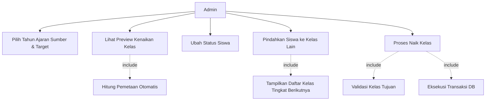
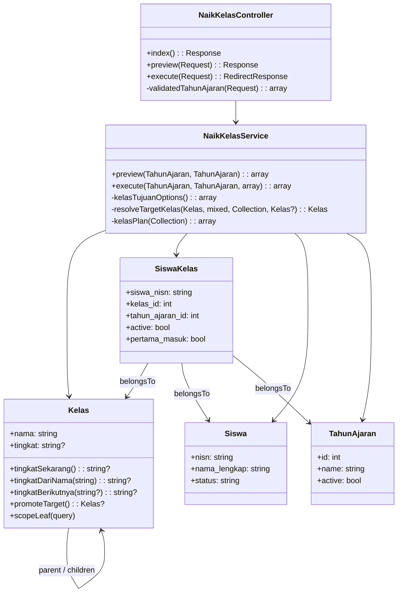
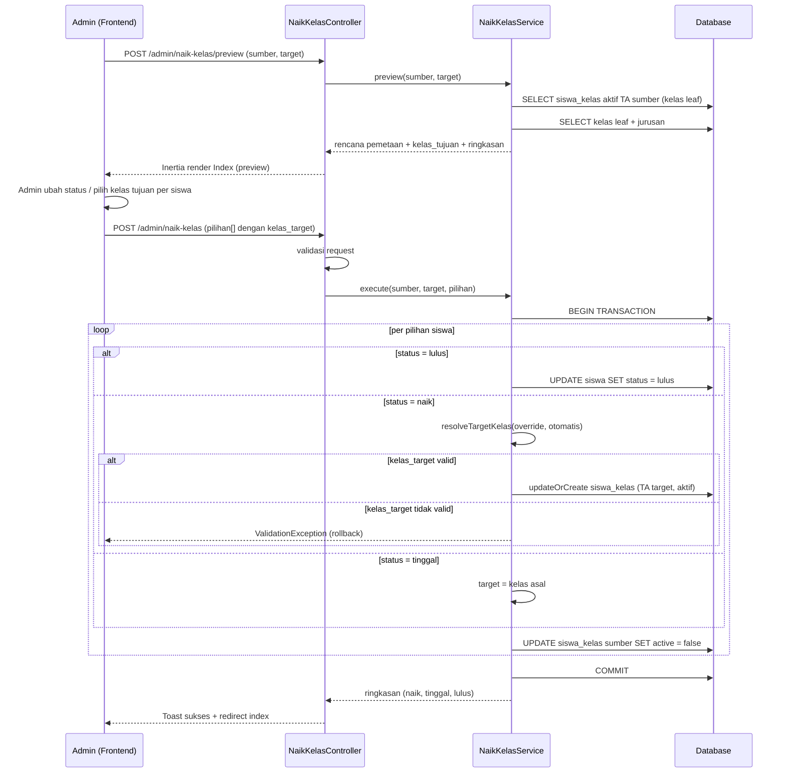
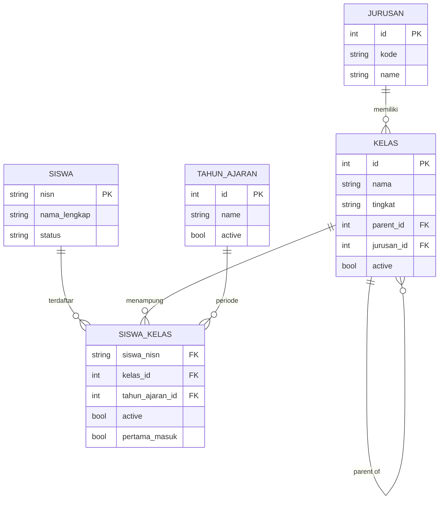

# Bahan UML — Fitur Naik Kelas dengan Pemindahan ke Kelas Lain

> Dokumen ini berisi **bahan siap pakai** untuk menggambar diagram UML di
> tool apa pun (StarUML, draw.io, Visio, Lucidchart): setiap elemen diagram
> dirinci dalam tabel. Mermaid disertakan sebagai pratinjau cepat.
> Untuk narasi lengkap & logika detail lihat `REQUIREMENTS-NAIK-KELAS.md`.

---

## 1. Use Case Diagram

### 1.1 Aktor

| # | Aktor | Deskripsi |
|---|---|---|
| A1 | Admin | Petugas (operator sekolah) yang mengelola kenaikan kelas. Satu-satunya aktor utama fitur ini. |
| A2 | Sistem | Bertindak sebagai aktor pendukung: menghitung pemetaan otomatis, memvalidasi, menulis DB. |

### 1.2 Daftar Use Case

| ID | Use Case | Aktor | Deskripsi |
|---|---|---|---|
| UC-01 | Pilih Tahun Ajaran Sumber & Target | A1 | Memilih TA sumber (mis. 2025/2026) dan TA target (mis. 2026/2027) pada form. |
| UC-02 | Lihat Preview Kenaikan Kelas | A1 | Sistem menghitung rencana pemetaan (status default tiap siswa + kelas tujuan) tanpa menulis DB. |
| UC-03 | Ubah Status Siswa | A1 | Mengubah status per siswa: Naik / Tinggal / Lulus. |
| UC-04 | Pindahkan Siswa ke Kelas Lain | A1 | Memilih rombel tujuan tingkat berikutnya untuk siswa berstatus Naik (opsional). |
| UC-05 | Proses Naik Kelas | A1 | Mengeksekusi seluruh pilihan dalam satu transaksi DB. |
| UC-06 | Hitung Pemetaan Otomatis | A2 | Include dari UC-02: menghitung target otomatis (X-RPL-10 → XI-RPL-10) & status default. |
| UC-07 | Tampilkan Daftar Kelas Tingkat Berikutnya | A2 | Include dari UC-04: daftar rombel leaf tingkat berikutnya, dikelompokkan per jurusan. |
| UC-08 | Validasi Kelas Tujuan | A2 | Include dari UC-05: memastikan kelas tujuan valid (rombel leaf & tingkat berikutnya). |
| UC-09 | Eksekusi Transaksi DB | A2 | Include dari UC-05: menulis siswa_kelas baru di TA target, menonaktifkan yang lama, update status lulus. |

### 1.3 Relasi

- `UC-02` —include→ `UC-06`
- `UC-04` —include→ `UC-07`
- `UC-05` —include→ `UC-08`
- `UC-05` —include→ `UC-09`
- (tidak ada relasi *extend* pada fitur ini)

### 1.4 Skenario Singkat per Use Case

| ID | Prekondisi | Alur Normal | Postkondisi | Alternatif |
|---|---|---|---|---|
| UC-01 | Admin login | Pilih TA sumber & target | TA terpilih berbeda | TA sama → sistem menolak (toast) |
| UC-02 | UC-01 selesai | Klik "Lihat Preview" | Rencana pemetaan + ringkasan tampil | Tidak ada siswa aktif → tabel kosong |
| UC-03 | UC-02 selesai | Ganti status siswa | Status baru tersimpan di state halaman (belum ke DB) | — |
| UC-04 | UC-02 selesai | Pilih "Pindah ke Kelas" utk siswa Naik | Kelas tujuan terpilih (default otomatis) | Tidak memilih → pakai otomatis |
| UC-05 | UC-02–UC-04 selesai | Klik "Proses Naik Kelas" | Data siswa_kelas baru di TA target, toast ringkasan | Kelas tujuan tidak valid → validasi error, transaksi dibatalkan |

### 1.5 Mermaid (pratinjau)



---

## 2. Activity Diagram

Dua diagram: **2.1 Alur Preview** (tanpa menulis DB) dan **2.2 Alur
Eksekusi** (satu transaksi DB). Bila memakai **swimlane**, bagilah menjadi
3 kolom: `Admin` | `NaikKelasService (Sistem)` | `Database`.

### 2.1 Preview — daftar node & keputusan

| # | Tipe | Nama node | Keterangan |
|---|---|---|---|
| P1 | Start | Mulai | Admin membuka halaman Naik Kelas |
| P2 | Action | Pilih TA Sumber & Target | — |
| P3 | Decision | TA sumber ≠ target? | [ya] lanjut P4; [tidak] → E1 |
| P4 | Action | Klik "Lihat Preview" | — |
| P5 | Action | Baca siswa_kelas aktif TA sumber (kelas leaf saja) | query DB |
| P6 | Action | Hitung per kelas asal: tingkat, target otomatis (promoteTarget), daftar kelas tujuan tingkat berikutnya | — |
| P7 | Action | Tentukan status default tiap siswa | target ada → Naik; tingkat XII → Lulus; selainnya → Tinggal |
| P8 | Action | Tampilkan tabel per kelas asal + ringkasan | (ringkasan naik/tinggal/lulus) |
| E1 | End | Toast error: TA harus berbeda, kembali ke awal | — |

### 2.2 Eksekusi — daftar node & keputusan

| # | Tipe | Nama node | Keterangan |
|---|---|---|---|
| E1 | Start | Mulai | Dari halaman preview yang sudah diisi pilihan |
| E2 | Action | Klik "Proses Naik Kelas" | — |
| E3 | Action | Validasi request (status in:naik,tinggal,lulus; kelas_target exists) | controller |
| E4 | Decision | Validasi lolos? | [tidak] → E2 (error per field); [ya] lanjut |
| E5 | Action | Buka transaksi DB (BEGIN) | — |
| E6 | Loop | Untuk setiap pilihan siswa | — |
| E7 | Decision | Status = lulus? | [ya] → E8; [tidak] → E9 |
| E8 | Action | UPDATE siswa SET status='lulus' + nonaktifkan siswa_kelas sumber | lalu ke E14 |
| E9 | Decision | Status = naik? | [ya] → E10; [tidak (tinggal)] → E13 |
| E10 | Decision | Kelas tujuan dipilih admin? | [ya] → E11; [tidak] → E12 |
| E11 | Decision | Kelas tujuan valid (rombel leaf & tingkat berikutnya)? | [tidak] → E15; [ya] → E13 |
| E12 | Action | Target = kelas tujuan otomatis; bila tidak ada → kelas asal | — |
| E13 | Action | updateOrCreate siswa_kelas di TA target (active=true) | — |
| E14 | Action | Nonaktifkan siswa_kelas sumber (active=false) | — |
| E15 | End | ValidationException → rollback seluruh transaksi | — |
| E16 | Decision | Semua pilihan diproses? | [tidak] → E6; [ya] → E17 |
| E17 | Action | COMMIT transaksi | — |
| E18 | Action | Toast sukses + ringkasan, kembali ke index | — |
| E19 | End | Selesai | — |

> Catatan: node E11→E15 adalah **fork/path error**; pada tool UML gunakan
> guard `[kelas tujuan tidak valid]` menuju end-node "Transaksi dibatalkan".

### 2.3 Mermaid (pratinjau gabungan)

```mermaid
flowchart TD
    START([Mulai]) --> P1{Pilih TA Sumber & Target}
    P1 -- beda --> PREV[Klik Lihat Preview]
    P1 -- sama --> ERR1[Toast Error: TA harus berbeda]
    ERR1 --> START

    PREV --> BACA[Baca siswa_kelas aktif di TA sumber<br/>hanya kelas rombel leaf]
    BACA --> HITUNG[Hitung per kelas asal:<br/>tingkat, target otomatis,<br/>daftar kelas tujuan tingkat berikutnya]
    HITUNG --> DEFAULT[Set status default:<br/>ada target -> Naik<br/>XII -> Lulus<br/>lainnya -> Tinggal]
    DEFAULT --> TAMPIL[Tampilkan tabel per kelas asal]

    TAMPIL --> ADM{Admin ubah per siswa?}
    ADM -- status --> SET[Set Naik / Tinggal / Lulus]
    ADM -- naik --> TARGET[Pilih Pindah ke Kelas]
    ADM -- selesai --> PROSES[Klik Proses Naik Kelas]

    PROSES --> VAL{Validasi semua pilihan}
    VAL -- kelas tujuan bukan<br/>tingkat berikutnya --> ERR2[ValidationException<br/>transaksi dibatalkan]
    ERR2 --> TAMPIL
    VAL -- valid --> TX[Transaksi DB]

    TX --> LOOP{Untuk setiap siswa}
    LOOP -- Lulus --> LULUS[siswa.status = lulus<br/>siswa_kelas sumber dinonaktifkan]
    LOOP -- Tinggal --> TINGGAL[siswa_kelas target = kelas asal<br/>siswa_kelas sumber dinonaktifkan]
    LOOP -- Naik --> NAIK{Kelas tujuan dipilih admin?}
    NAIK -- ya --> OVR[target = kelas pilihan admin]
    NAIK -- tidak --> AUTO[target = kelas tujuan otomatis<br/>atau kelas asal bila tidak ada]
    OVR --> TULIS[updateOrCreate siswa_kelas di TA target (aktif)]
    AUTO --> TULIS
    TINGGAL --> TULIS
    LULUS --> LOOP

    LOOP -- selesai --> TOAST[Toast sukses + ringkasan]
    TOAST --> FIN([Selesai])
```

---

## 3. Class Diagram

### 3.1 Daftar class, atribut, method

**NaikKelasController** (App\Http\Controllers\Admin)

| Tipe | Nama | Keterangan |
|---|---|---|
| atribut | `# naikKelas: NaikKelasService` | injeksi dependensi |
| method | `+ index(): Inertia\Response` | form pilih TA, preview=null |
| method | `+ preview(Request): Inertia\Response` | hitung pemetaan tanpa menulis DB |
| method | `+ execute(Request): RedirectResponse` | eksekusi + toast |
| method | `- validatedTahunAjaran(Request): array` | validasi umum TA sumber & target |

**NaikKelasService** (App\Services)

| Tipe | Nama | Keterangan |
|---|---|---|
| method | `+ preview(TahunAjaran, TahunAjaran): array` | rencana pemetaan + ringkasan + kelas_tujuan |
| method | `+ execute(TahunAjaran, TahunAjaran, array pilihan): array` | eksekusi dalam 1 transaksi |
| method | `- kelasTujuanOptions(): array` | daftar rombel leaf tingkat berikutnya, key = tingkat sumber |
| method | `- resolveTargetKelas(Kelas, mixed, Collection, ?Kelas): Kelas` | override kelas tujuan + validasi |
| method | `- kelasPlan(Collection): array` | cache tingkat & target otomatis per kelas |

**Kelas** (App\Models)

| Tipe | Nama | Keterangan |
|---|---|---|
| atribut | `nama: string` | `X-RPL-10`, `XI-RPL-10` |
| atribut | `tingkat: ?string` | hanya root (X/XI/XII) |
| atribut | `parent_id: ?int` | rantai ke root |
| atribut | `jurusan_id: ?int` | |
| atribut | `active: bool` | |
| method | `+ parent(): BelongsTo` | self-referensi |
| method | `+ children(): HasMany` | self-referensi |
| method | `+ jurusan(): BelongsTo` | |
| method | `+ tingkatSekarang(): ?string` | root tingkat, fallback prefiks nama |
| method | `+ tingkatDariNama(string): ?string` | statis; regex `^(XII\|XI\|X)(?=[\s-]\|$)` |
| method | `+ tingkatBerikutnya(?string): ?string` | statis; X→XI, XI→XII, XII→null |
| method | `+ promoteTarget(): ?Kelas` | ganti prefiks tingkat nama, cari kelas |
| method | `+ scopeLeaf(Builder)` | kelas tanpa anak |

**SiswaKelas** (App\Models)

| Tipe | Nama | Keterangan |
|---|---|---|
| atribut | `siswa_nisn: string` | PK parsial |
| atribut | `kelas_id: int` | PK parsial |
| atribut | `tahun_ajaran_id: int` | PK parsial |
| atribut | `active: bool` | nonaktif = riwayat |
| atribut | `pertama_masuk: bool` | |
| method | `+ siswa(): BelongsTo` | |
| method | `+ kelas(): BelongsTo` | |
| method | `+ tahunAjaran(): BelongsTo` | |

**Siswa** (App\Models)

| Tipe | Nama | Keterangan |
|---|---|---|
| atribut | `nisn: string` | PK |
| atribut | `nama_lengkap: string` | |
| atribut | `status: string` | aktif / lulus |
| method | `+ siswaKelas(): HasMany` | |

**TahunAjaran** (App\Models)

| Tipe | Nama | Keterangan |
|---|---|---|
| atribut | `id: int` | PK |
| atribut | `name: string` | mis. 2025/2026 |
| atribut | `active: bool` | |
| method | `+ siswaKelas(): HasMany` | |

### 3.2 Relasi antar class

| Dari | Ke | Multiplicity | Jenis relasi |
|---|---|---|---|
| NaikKelasController | NaikKelasService | 1 → 1 | dependency (composition lemah) |
| NaikKelasService | Kelas | 1 → * | dependency |
| NaikKelasService | SiswaKelas | 1 → * | dependency |
| NaikKelasService | Siswa | 1 → * | dependency |
| NaikKelasService | TahunAjaran | 1 → * | dependency |
| SiswaKelas | Kelas | * → 1 | association (belongsTo) |
| SiswaKelas | Siswa | * → 1 | association (belongsTo) |
| SiswaKelas | TahunAjaran | * → 1 | association (belongsTo) |
| Siswa | SiswaKelas | 1 → * | association (hasMany) |
| TahunAjaran | SiswaKelas | 1 → * | association (hasMany) |
| Kelas | Kelas | 1 → * | association self (parent / children) |
| Kelas | Jurusan | * → 1 | association (belongsTo) |

### 3.3 Mermaid (pratinjau)



---

## 4. Sequence Diagram

### 4.1 Peserta (participants)

| Lifeline | Objek |
|---|---|
| A | Admin (Frontend SPA Inertia) |
| C | NaikKelasController |
| S | NaikKelasService |
| DB | Database (PostgreSQL) |

### 4.2 Preview — daftar pesan urut

| Urut | Pengirim | Penerima | Pesan / Aktivitas | Catatan |
|---|---|---|---|---|
| 1 | A | C | `POST /admin/naik-kelas/preview` (tahun_ajaran_sumber, tahun_ajaran_target) | — |
| 2 | C | C | validasi request + cek TA berbeda | sama → toast error, render form |
| 3 | C | S | `preview(sumber, target)` | — |
| 4 | S | DB | SELECT siswa_kelas aktif TA sumber, kelas leaf | with kelas.parent.parent, siswa |
| 5 | S | DB | SELECT kelas leaf + jurusan (untuk daftar kelas tujuan) | — |
| 6 | S | S | hitung kelasPlan (tingkat + promoteTarget), status default, ringkasan | — |
| 7 | S | C | return array: sumber, target, kelas[], ringkasan, kelas_tujuan | — |
| 8 | C | A | Inertia render Index dengan preview | — |

### 4.3 Eksekusi — daftar pesan urut

| Urut | Pengirim | Penerima | Pesan / Aktivitas | Catatan |
|---|---|---|---|---|
| 1 | A | C | `POST /admin/naik-kelas` (pilihan[]: nisn, status, kelas_target?) | — |
| 2 | C | C | validasi: status in:naik,tinggal,lulus; kelas_target exists:kelas,id | gagal → 422 per field |
| 3 | C | S | `execute(sumber, target, pilihan)` | — |
| 4 | S | DB | BEGIN TRANSACTION | — |
| 5 | S | DB | SELECT siswa_kelas aktif TA sumber utk nisn terpilih | groupBy siswa |
| 6 | S | DB | SELECT kelas target (kelas_target terisi, status naik) | with parent.parent |
| 7 | S | S | loop tiap pilihan siswa | — |
| 8 | S | S | alt status = lulus → UPDATE siswa status='lulus'; nonaktifkan siswa_kelas sumber | — |
| 9 | S | S | alt status = naik → resolveTargetKelas(override, otomatis, kelas asal) | override valid = dipakai; invalid → throw ValidationException |
| 10 | S | S | alt status = tinggal → target = kelas asal | — |
| 11 | S | DB | updateOrCreate siswa_kelas (siswa_nisn, kelas_id, tahun_ajaran_id target) | active=true |
| 12 | S | DB | UPDATE siswa_kelas sumber SET active=false | — |
| 13 | S | DB | COMMIT | — |
| 14 | S | C | return ringkasan (naik, tinggal, lulus) | — |
| 15 | C | A | Toast sukses + redirect ke index | — |

> Frame **alt**: `[status=lulus]`, `[status=naik]`, `[status=tinggal]`
> Frame **loop**: `[untuk setiap pilihan siswa]` (baris 7–12)
> Frame **alt** (baris 9): `[kelas_target valid]` vs `[tidak valid → rollback, balik ke baris 1 dengan error]`

### 4.4 Mermaid (pratinjau)



---

## 5. State Diagram

### 5.1 State `siswa.status`

| State | Transisi | Guard / Trigger |
|---|---|---|
| `aktif` | → `lulus` | siswa diproses naik kelas dengan status **Lulus** |
| `lulus` | — | terminal |

### 5.2 State `siswa_kelas.active`

| State | Transisi | Guard / Trigger |
|---|---|---|
| `active=true` (TA sumber) | → `active=false` | eksekusi naik kelas (semua status) |
| `active=true` (TA target) | — | dibuat saat eksekusi (updateOrCreate) |

### 5.3 Mermaid (pratinjau)

```mermaid
stateDiagram-v2
    [*] --> aktif: siswa terdaftar
    aktif --> lulus: naik kelas status Lulus
    lulus --> [*]

    state "siswa_kelas" {
        [*] --> AktifSumber: terdaftar di TA sumber
        AktifSumber --> Nonaktif: eksekusi naik kelas
        [*] --> AktifTarget: updateOrCreate di TA target
    }
```

---

## 6. ERD (pelengkap laporan)

### 6.1 Entitas & atribut kunci

| Entitas | Atribut kunci |
|---|---|
| `kelas` | id (PK), nama, tingkat, parent_id (FK self), jurusan_id (FK), active |
| `jurusan` | id (PK), kode, name |
| `siswa` | nisn (PK), nama_lengkap, status |
| `tahun_ajaran` | id (PK), name, active |
| `siswa_kelas` | siswa_nisn (FK), kelas_id (FK), tahun_ajaran_id (FK), active, pertama_masuk (PK gabungan = 3 FK) |

### 6.2 Relasi

| Dari | Ke | Kardinalitas | Keterangan |
|---|---|---|---|
| kelas | kelas | 1 : N | parent → children (hierarki root/jurusan/rombel) |
| jurusan | kelas | 1 : N | satu jurusan punya banyak kelas |
| siswa | siswa_kelas | 1 : N | satu siswa banyak riwayat per TA |
| kelas | siswa_kelas | 1 : N | satu rombel banyak siswa per TA |
| tahun_ajaran | siswa_kelas | 1 : N | satu TA banyak penempatan |

### 6.3 Mermaid (pratinjau)



---

## 7. Ringkasan Elemen untuk Semua Diagram

| Diagram | Elemen kunci |
|---|---|
| Use Case | 1 aktor (Admin), 9 use case, 4 relasi include |
| Activity | 2 alur (preview & eksekusi), 3 swimlane, 5+ keputusan, 1 loop |
| Class | 5 class utama + jurusan, 12+ relasi association/dependency |
| Sequence | 4 lifeline, 15 pesan (preview 8, eksekusi 15) |
| State | 2 state machine (siswa.status & siswa_kelas.active) |
| ERD | 5 entitas, 5 relasi 1:N |