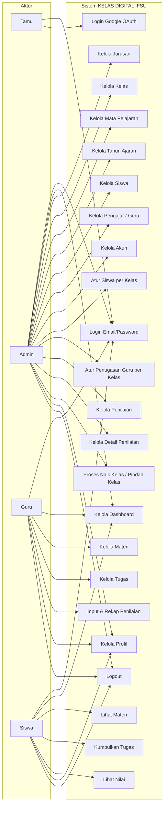
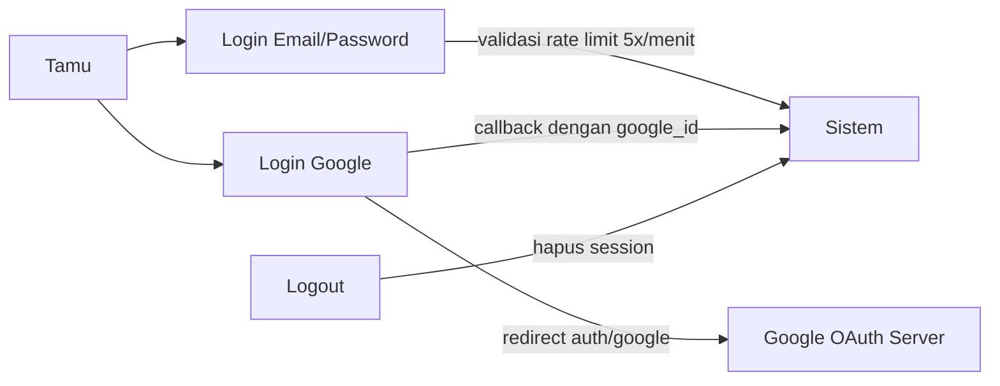
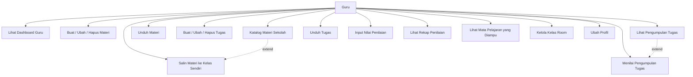
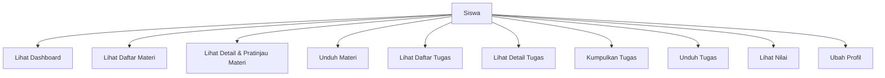

# Use Case Diagram — KELAS DIGITAL IFSU

Diagram use case memetakan interaksi antara aktor dengan fungsi-fungsi sistem. Aplikasi memiliki **4 aktor**: Tamu, Admin, Guru, dan Siswa.

## 1. Use Case Utama (Keseluruhan)



## 2. Use Case — Autentikasi



Keterangan:
- Login email+password dibatasi **5 percobaan per menit per email + IP** (`ThrottleRequests`).
- Login Google memakai **Laravel Socialite**; user disambungkan lewat kolom `google_id`.
- Setelah login, redirect ke `app.dashboard` sesuai peran.

## 3. Use Case — Admin

```mermaid
flowchart TB
    A[Admin]

    UC1[Lihat Dashboard]
    UC2[CRUD Jurusan]
    UC3[CRUD Kelas]
    UC4[CRUD Mata Pelajaran]
    UC5[CRUD Tahun Ajaran]
    UC6[CRUD Data Siswa]
    UC7[CRUD Data Guru/Pengajar]
    UC8[Kelola Akun Guru]
    UC9[Kelola Akun Siswa]
    UC10[Kelola Akun Admin]
    UC11[Atur Siswa ke Kelas]
    UC12[Atur Guru ke Kelas & Matpel]
    UC13[Kelola Penilaian]
    UC14[Input Detail Penilaian]
    UC15[Filter Penilaian per Kelas/Matpel]
    UC16[Proses Naik Kelas]
    UC17[Pindah Kelas (per siswa)]
    UC18[Ubah Profil]

    A --> UC1
    A --> UC2
    A --> UC3
    A --> UC4
    A --> UC5
    A --> UC6
    A --> UC7
    A --> UC8
    A --> UC9
    A --> UC10
    A --> UC11
    A --> UC12
    A --> UC13
    A --> UC14
    A --> UC15
    A --> UC16
    A --> UC17
    A --> UC18

    UC16 -.->|include| UC17
```

Detail aksi tiap use case admin (berdasarkan `routes/web.php`):

| Use Case | Endpoint (prefix `admin`) | Controller |
|----------|---------------------------|------------|
| Dashboard | `GET admin` | `Admin\DashboardController@__invoke` |
| Jurusan | `GET/POST/PUT/DELETE admin/jurusan` | `Admin\JurusanController` |
| Kelas | `GET/POST/PUT/DELETE admin/kelas` | `Admin\KelasController` |
| Mata Pelajaran | `GET/POST/PUT/DELETE admin/matpel` | `Admin\MatpelController` |
| Tahun Ajaran | `GET/POST/PUT/DELETE admin/tahun-ajaran` | `Admin\TahunAjaranController` |
| Siswa | `GET/POST/PUT/DELETE admin/siswa` | `Admin\SiswaController` |
| Akun Siswa | `GET/POST/PUT/DELETE admin/siswa/{siswa}/akun` | `Admin\AkunSiswaController` |
| Siswa->Kelas | `GET/POST/PUT/DELETE admin/siswa/{siswa}/kelas` | `Admin\SiswaKelasController` |
| Pengajar | `GET/POST/PUT/DELETE admin/pengajar` | `Admin\PengajarController` |
| Akun Guru | `GET/POST/PUT/DELETE admin/pengajar/{guru}/akun` | `Admin\AkunGuruController` |
| Penugasan Guru | `GET/POST/PUT/DELETE admin/pengajar/{guru}/penugasan` | `Admin\GuruKelasController` |
| Penilaian | `GET/POST/PUT/DELETE admin/penilaian` | `Admin\PenilaianController` |
| Detail Penilaian | `GET/POST admin/penilaian/{p}/penugasan/{g}/siswa/{s}` | `Admin\DetailPenilaianController` |
| Naik Kelas | `GET admin/naik-kelas`, `POST admin/naik-kelas/preview`, `POST admin/naik-kelas/execute` | `Admin\NaikKelasController` |
| Akun Admin | `GET/POST/PUT/DELETE admin/akun-admin` | `Admin\AkunAdminController` |
| Profil | `GET/PUT admin/profil` | `Admin\ProfilController` |

## 4. Use Case — Guru



Detail aksi tiap use case guru (prefix `app`):

| Use Case | Endpoint | Controller |
|----------|----------|------------|
| Dashboard | `GET app` | `DashboardController` (sama utk semua peran) |
| Materi | `GET/POST/PUT/DELETE app/guru/materi` | `Guru\MateriController` |
| Katalog | `GET app/guru/materi/katalog` | `Guru\MateriController@katalog` |
| Salin materi | `POST app/guru/materi/salin` | `Guru\MateriController@salin` |
| Unduh materi | `GET app/guru/materi/{materi}/unduh` | `Guru\MateriController@unduh` |
| Tugas | `GET/POST/PUT/DELETE app/guru/tugas` | `Guru\TugasController` |
| Nilai tugas | `PUT app/guru/tugas/{tugas}/nilai` | `Guru\TugasController@nilai` |
| Pengumpulan | `GET app/guru/tugas/{tugas}/pengumpulan` | `Guru\TugasController@pengumpulan` |
| Penilaian | `GET app/guru/penilaian` | `Guru\PenilaianController` |
| Rekap | `GET app/guru/penilaian/rekap` | `Guru\PenilaianController@rekap` |
| Input nilai | `POST app/guru/penilaian/{penilaian}/{guruKelas}` | `Guru\PenilaianController@store` |
| Matpel saya | `GET app/matpel-saya` | `MataPelajaranGuruController@index` |
| Kelas room | `GET app/matpel/{matpel}/kelas-{id}/manage` | `KelasController` |

## 5. Use Case — Siswa



Detail aksi tiap use case siswa (prefix `app`):

| Use Case | Endpoint | Controller |
|----------|----------|------------|
| Materi | `GET app/materi`, `GET app/materi/{materi}` | `Siswa\MateriController` |
| Pratinjau | `GET app/materi/{materi}/lihat` | `Siswa\MateriController@lihat` |
| Unduh | `GET app/materi/{materi}/unduh` | `Siswa\MateriController@unduh` |
| Tugas | `GET app/tugas`, `GET app/tugas/{tugas}` | `Siswa\TugasController` |
| Kumpul | `POST app/tugas/{tugas}/kumpul` | `Siswa\TugasController@kumpul` |
| Nilai | `GET app/nilai` | `Siswa\PenilaianController@index` |

## 6. Daftar Use Case Lengkap

| Kode | Use Case | Aktor | Prioritas |
|------|----------|-------|-----------|
| UC-01 | Login email/password | Tamu | Tinggi |
| UC-02 | Login Google OAuth | Tamu | Sedang |
| UC-03 | Logout | Semua | Tinggi |
| UC-04 | Lihat dashboard (KPI) | Admin/Guru/Siswa | Tinggi |
| UC-05 | CRUD Jurusan | Admin | Tinggi |
| UC-06 | CRUD Kelas | Admin | Tinggi |
| UC-07 | CRUD Mata Pelajaran | Admin | Tinggi |
| UC-08 | CRUD Tahun Ajaran | Admin | Tinggi |
| UC-09 | CRUD Data Siswa | Admin | Tinggi |
| UC-10 | Kelola akun siswa/guru/admin | Admin | Tinggi |
| UC-11 | Atur siswa ke kelas | Admin | Tinggi |
| UC-12 | Atur penugasan guru+matpel per kelas | Admin | Tinggi |
| UC-13 | CRUD Penilaian | Admin | Tinggi |
| UC-14 | Input detail penilaian | Admin | Tinggi |
| UC-15 | Naik kelas / pindah kelas | Admin | Tinggi |
| UC-16 | Kelola materi | Guru | Tinggi |
| UC-17 | Kelola tugas | Guru | Tinggi |
| UC-18 | Menilai pengumpulan tugas | Guru | Tinggi |
| UC-19 | Input & rekap penilaian | Guru | Tinggi |
| UC-20 | Lihat/unduh materi | Siswa | Tinggi |
| UC-21 | Kumpulkan tugas | Siswa | Tinggi |
| UC-22 | Lihat nilai | Siswa | Tinggi |
| UC-23 | Kelola profil | Semua | Sedang |