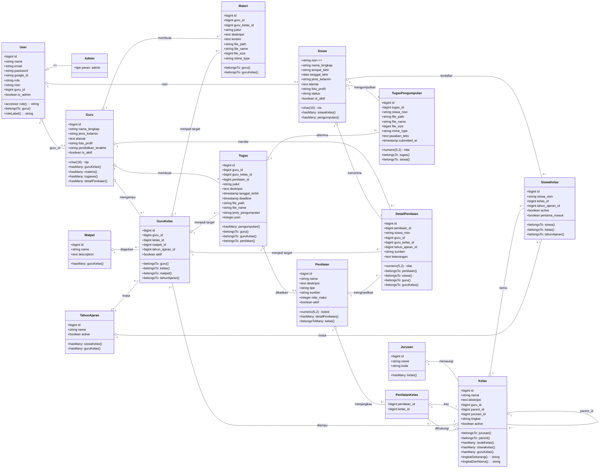
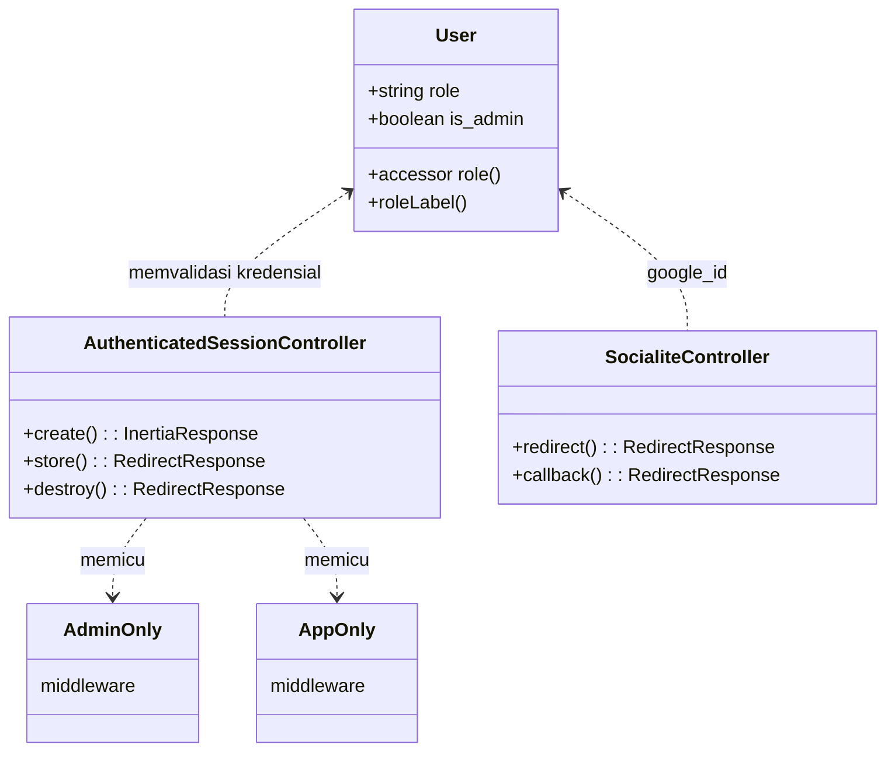
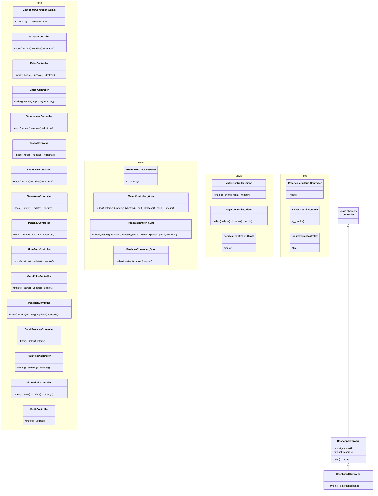
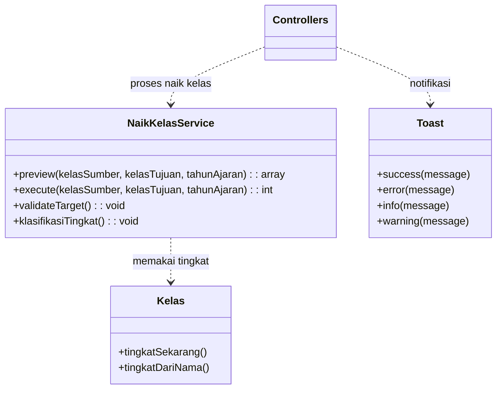

# Class Diagram — KELAS DIGITAL IFSU

Diagram kelas memodelkan seluruh **model Eloquent** di `app/Models/` beserta relasi dan atributnya (berdasarkan skema basis data PostgreSQL). Diagram ditulis dalam notasi Mermaid `classDiagram`.

## 1. Diagram Kelas Keseluruhan

## 2. Diagram Kelas — Sisi Autentikasi & Peran

## 3. Diagram Kelas — Arsitektur Controller (per paket)

## 4. Diagram Kelas — Services & Support

## 5. Deskripsi Relasi Penting

| Relasi | Jenis | Penjelasan |
|--------|-------|------------|
| `User` → `Guru` / `Siswa` | 1:0..1 | Kolom `guru_id` / `nisn` pada tabel `users` menghubungkan akun login dengan data profil. |
| `Guru` → `GuruKelas` | 1:N | Satu guru dapat mengampu banyak kelas (dengan mata pelajaran tertentu) per tahun ajaran. |
| `Kelas` → `Kelas` (parent_id) | 1:N | Kelas berbasis tingkatan: **kelas induk** (mis. `XI RPL`) menjadi parent dari **rombongan** (mis. `XI RPL 1`). |
| `Siswa` → `SiswaKelas` → `Kelas` | 1:N:1 | Keanggotaan siswa pada kelas bersifat historis per tahun ajaran (`tahun_ajaran_id`). |
| `GuruKelas` → `Materi`/`Tugas` | 1:N | Materi dan tugas dibagikan ke kelas yang diampu guru (relasi `guru_kelas_id`). |
| `Tugas` → `TugasPengumpulan` | 1:N | Satu tugas dapat dikumpulkan banyak siswa; nilai tugas disimpan pada `nilai` pengumpulan. |
| `Penilaian` → `PenilaianKelas` → `Kelas` | 1:N:1 | Satu penilaian (mis. "UTS", "PAS") menjangkau banyak kelas. |
| `Penilaian` → `DetailPenilaian` | 1:N | Nilai tiap siswa per penilaian disimpan pada `detail_penilaian`, dengan referensi `guru_kelas_id` & `tahun_ajaran_id`. |
| `Tugas` → `Penilaian` | N:1 | Tugas dapat dikaitkan ke salah satu penilaian agar nilainya dapat diakumulasi. |