# Sequence Diagram — KELAS DIGITAL IFSU

Diagram urutan (sequence) menggambarkan interaksi antar objek sepanjang waktu untuk alur-alur utama aplikasi. Notasi: Mermaid `sequenceDiagram`.

## 1. Autentikasi — Login Email/Password

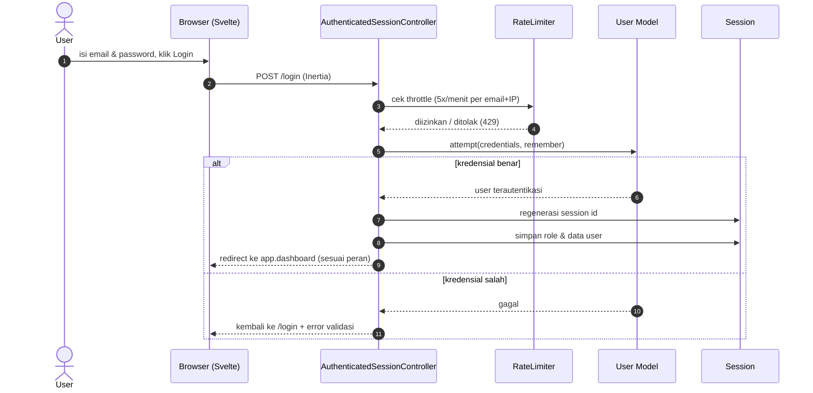

## 2. Autentikasi — Login Google OAuth

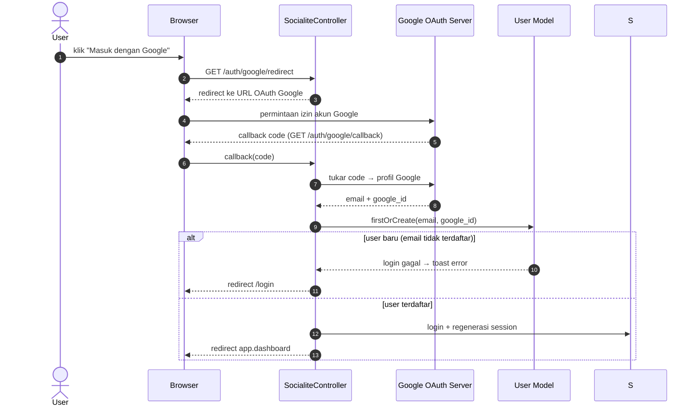

## 3. Admin — Kelola Data Master (CRUD Jurusan)

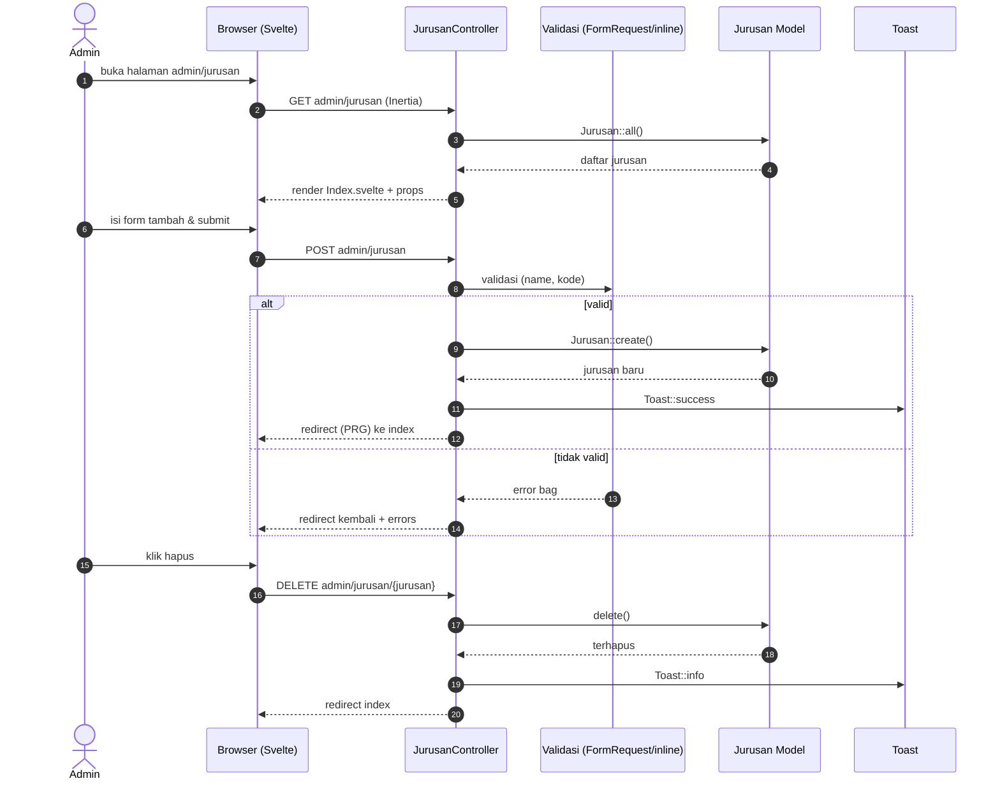

> Pola yang sama (GET list → POST create → PUT update → DELETE destroy + Toast + PRG) dipakai oleh controller master lainnya: **Kelas, Matpel, TahunAjaran, Siswa, Pengajar, Penilaian, AkunAdmin**.

## 4. Admin — Kelola Akun Guru & Atur Penugasan

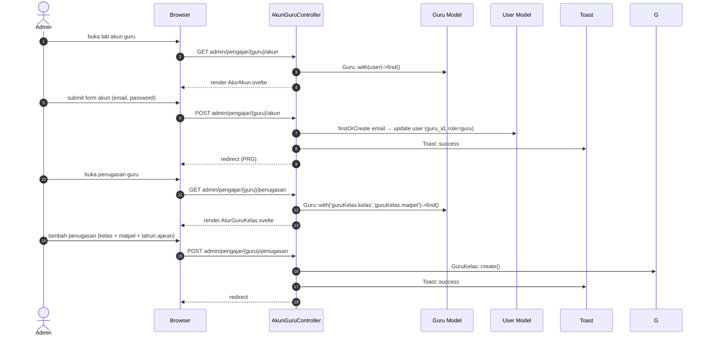

## 5. Admin — Atur Siswa ke Kelas

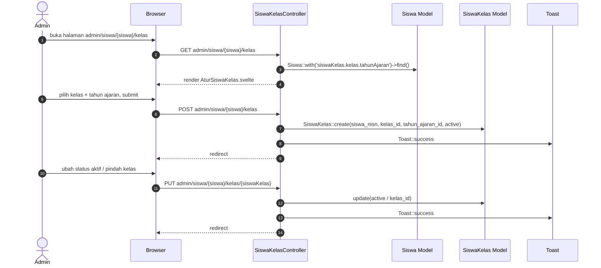

## 6. Admin — Kelola Penilaian & Detail Penilaian

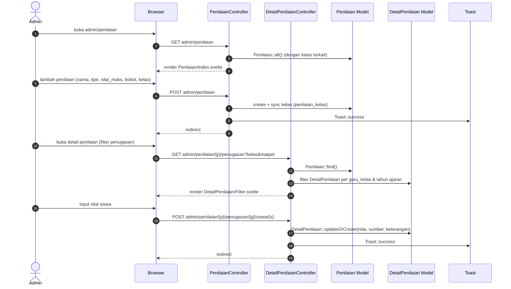

## 7. Guru — Kelola Materi

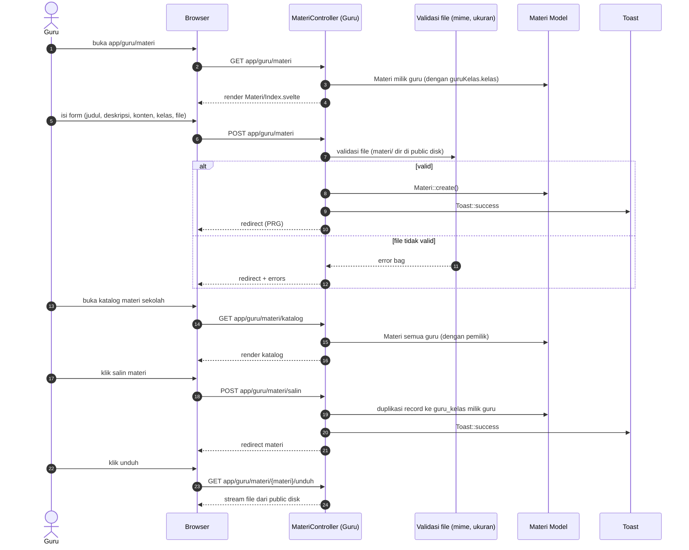

## 8. Guru — Buat Tugas & Menilai Pengumpulan

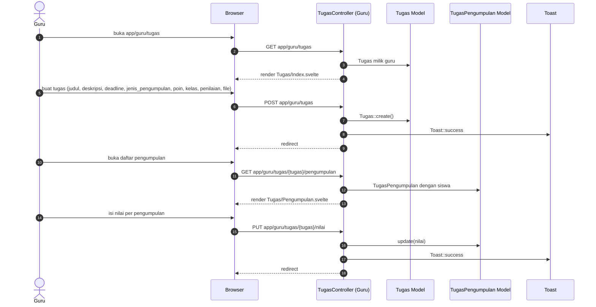

## 9. Siswa — Lihat Materi

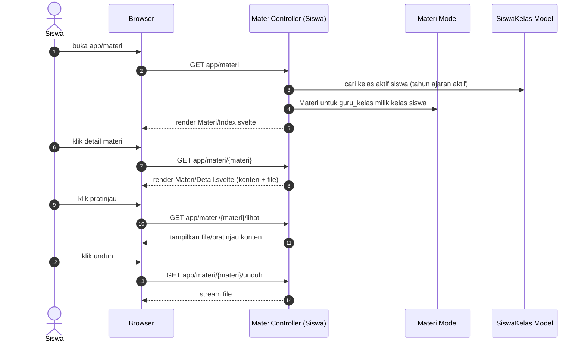

## 10. Siswa — Kumpulkan Tugas

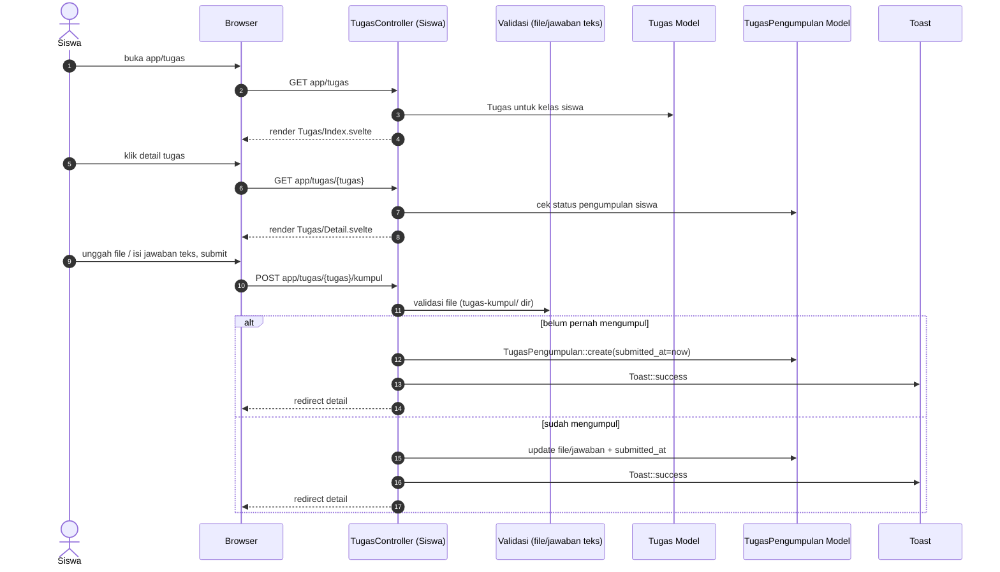

## 11. Siswa — Lihat Nilai

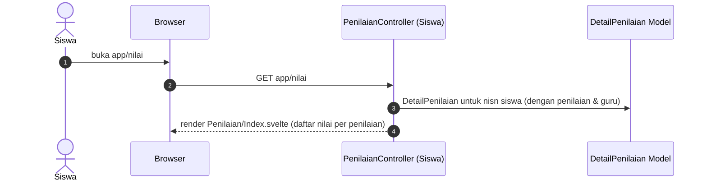

## 12. Naik Kelas — Preview & Execute

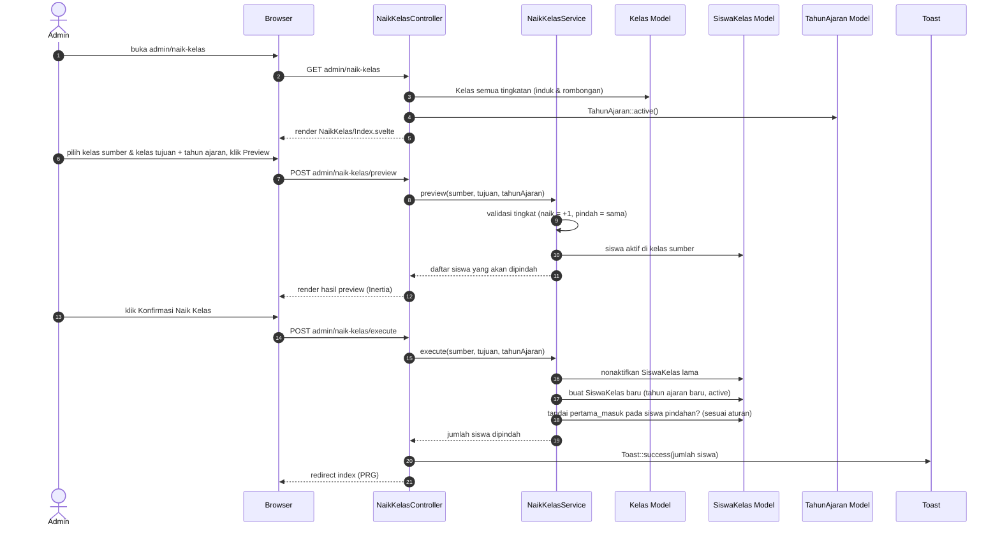

## 13. Guru — Input & Rekap Penilaian

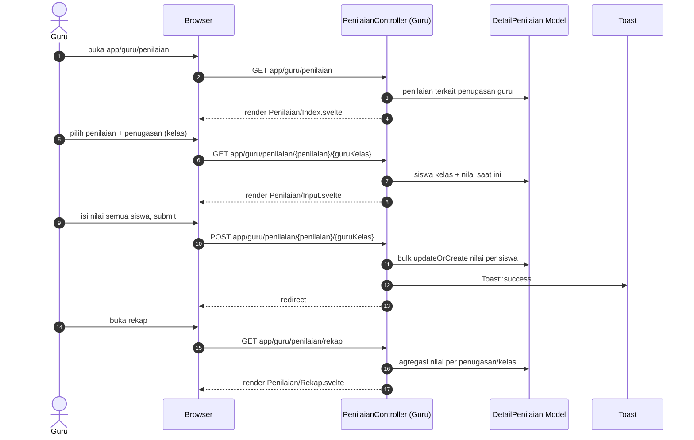