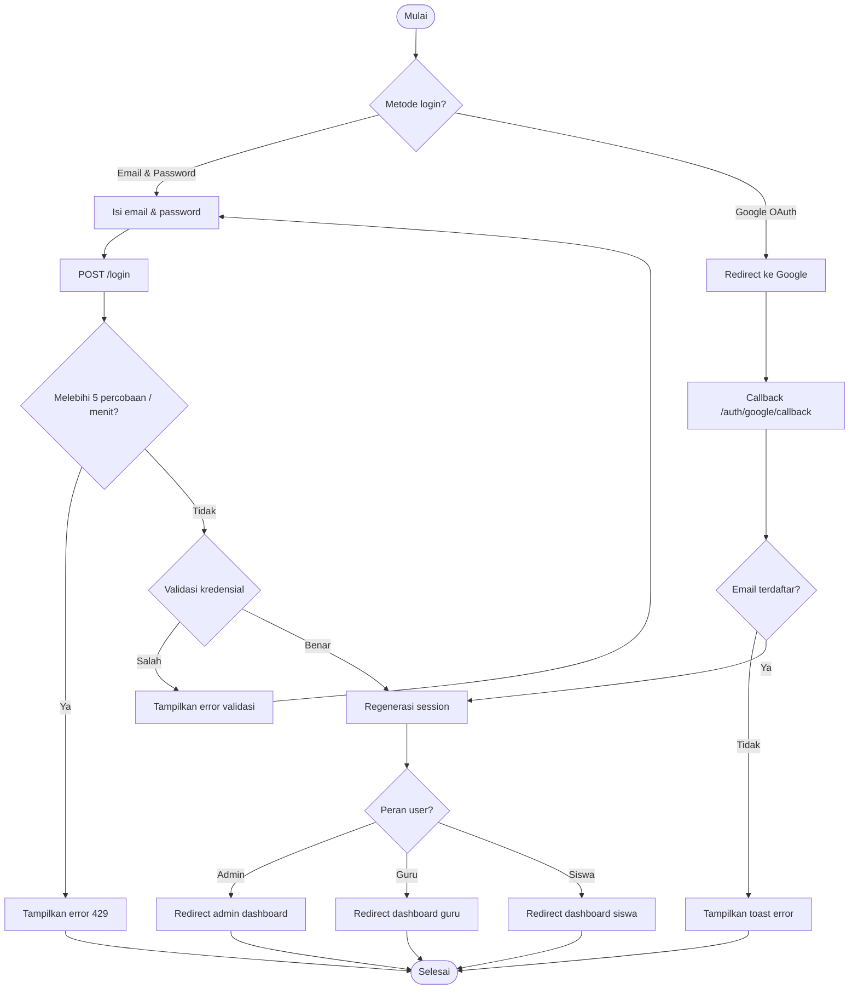
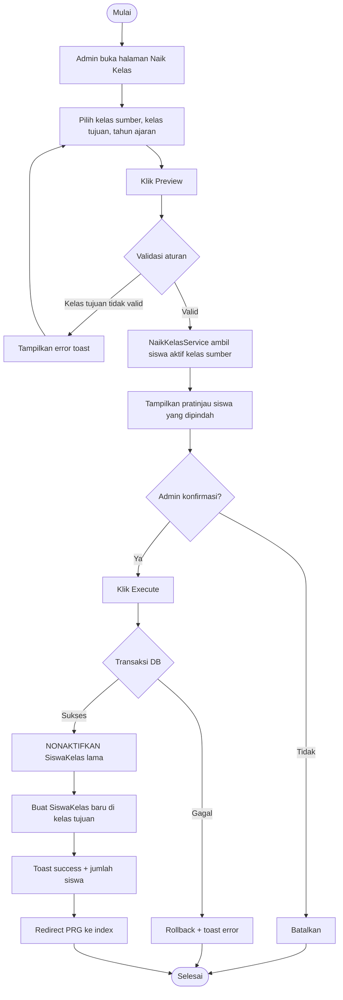
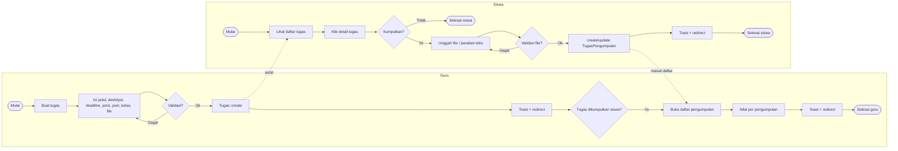
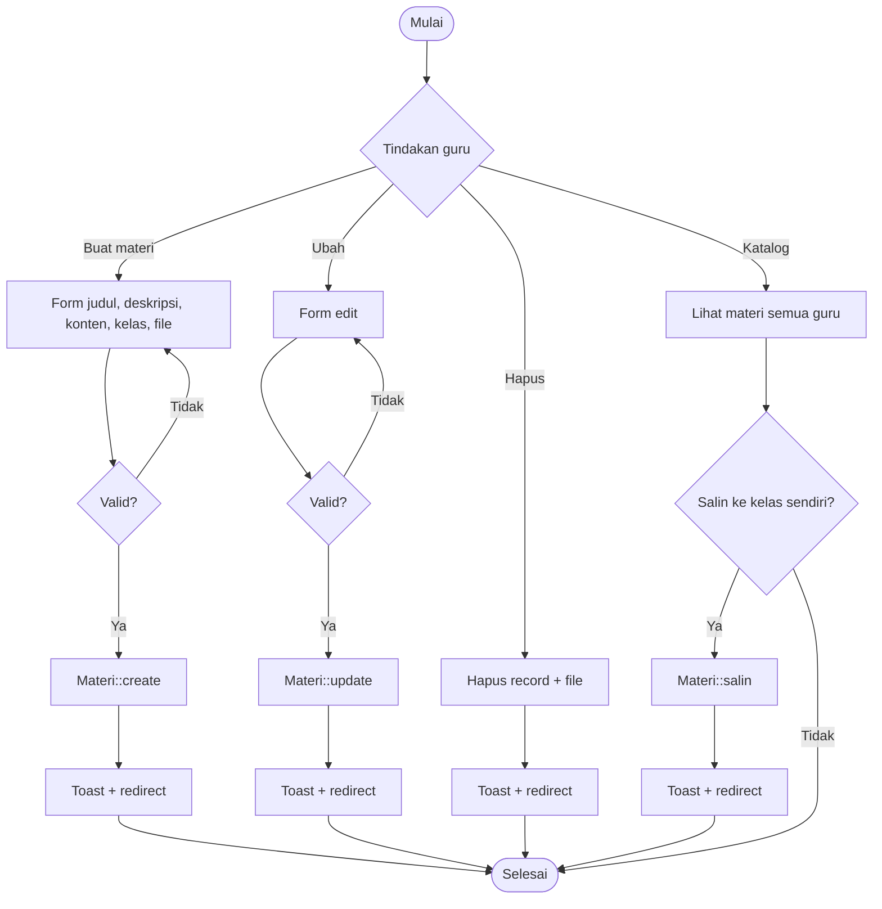
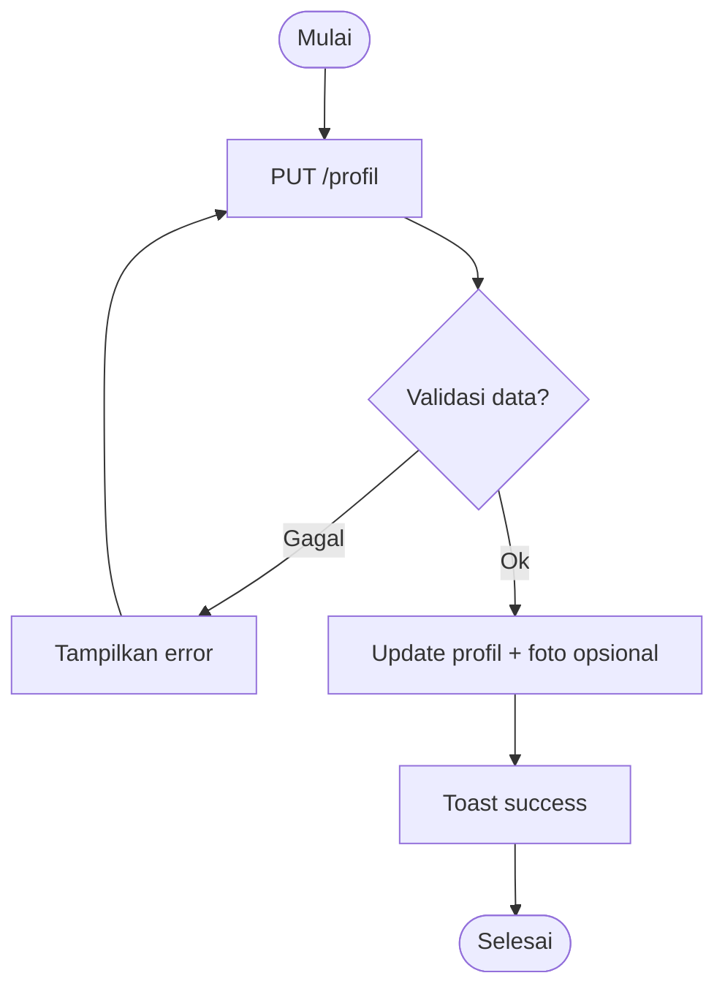
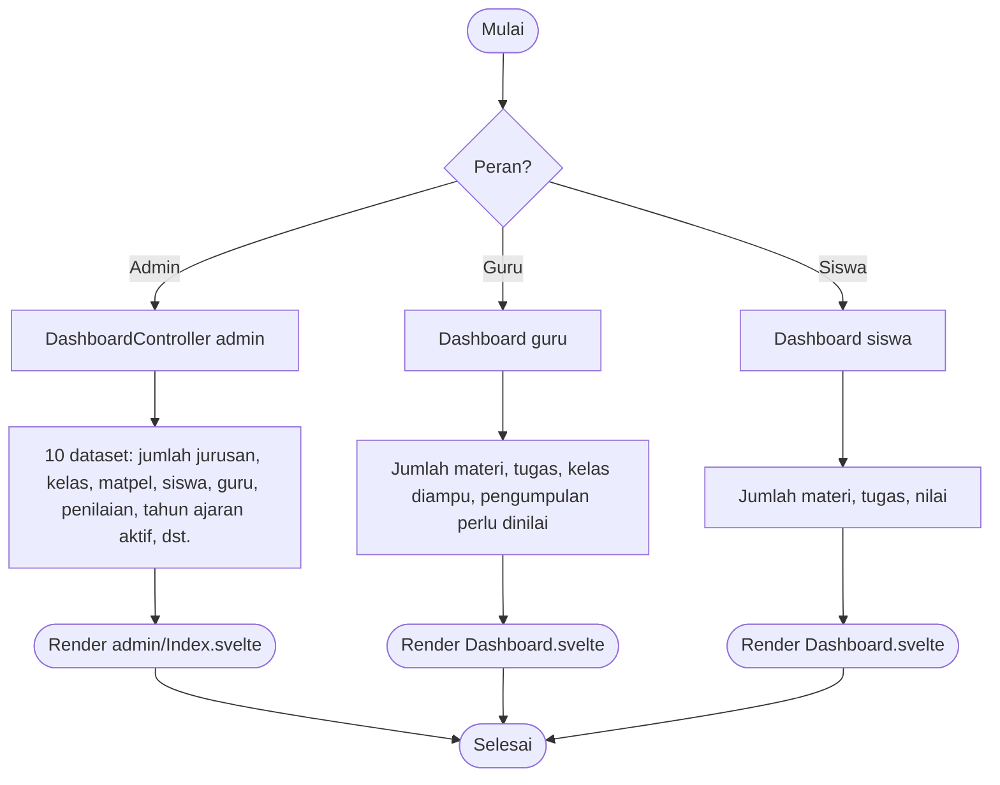

# Activity Diagram — KELAS DIGITAL IFSU

Diagram aktivitas memodelkan alur kerja (workflow) proses bisnis utama aplikasi. Notasi: Mermaid `flowchart` dengan simbol keputusan (diamond) dan swimlane per aktor.

## 1. Alur Login



## 2. Alur Naik Kelas (Admin)



## 3. Alur Kelola Tugas (Guru → Siswa → Guru)



## 4. Alur Input Penilaian (Guru)

```mermaid
flowchart TB
    Start([Mulai]) --> L[Guru buka Penilaian]
    L --> P{Pilih penilaian + kelas?}
    P -->|Tidak| End([Selesai])
    P -->|Ya| D[GET penilaian/{penilaian}/{guruKelas}]
    D --> R[Ambil siswa kelas + nilai eksisting]
    R --> F[Isi nilai semua siswa]
    F --> V{Valid? <= nilai_maks}
    V -->|Tidak| E1[Tampilkan error]
    E1 --> F
    V -->|Ya| S[bulk updateOrCreate DetailPenilaian]
    S --> T[Toast success]
    T --> Rk{Buka rekap?}
    Rk -->|Ya| X[GET rekap → agregasi per kelas]
    X --> End
    Rk -->|Tidak| End
```

## 5. Alur Kelola Materi (Guru)



## 6. Alur Kelola Akun (Admin)

```mermaid
flowchart TB
    Start([Mulai]) --> Tgt{Tujuan admin}
    Tgt -->|Akun guru| G1[Buka admin/pengajar/{guru}/akun]
    G1 --> G2[Isi email & password]
    G2 --> G3[firstOrCreate user + set guru_id & role]
    G3 --> GN[Toast + redirect]
    Tgt -->|Akun siswa| S1[Buka admin/siswa/{siswa}/akun]
    S1 --> S2[Isi email & password]
    S2 --> S3[firstOrCreate user + set nisn & role]
    S3 --> SN[Toast + redirect]
    Tgt -->|Akun admin| A1[Buka admin/akun-admin]
    A1 --> A2[Isi nama, email, password]
    A2 --> A3[User::create role admin]
    A3 --> AN[Toast + redirect]
    GN --> End([Selesai])
    SN --> End
    AN --> End
```

## 7. Alur Profil (Semua Peran)



## 8. Alur Dashboard (Semua Peran)

