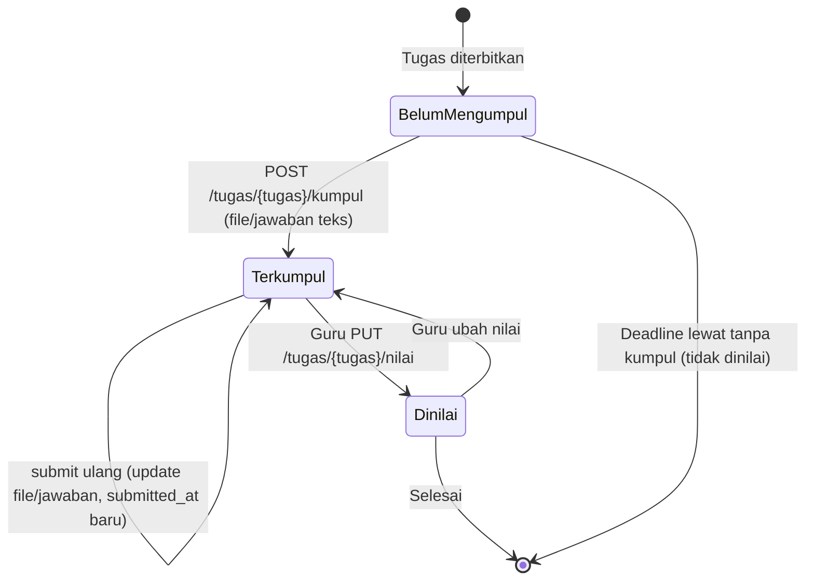
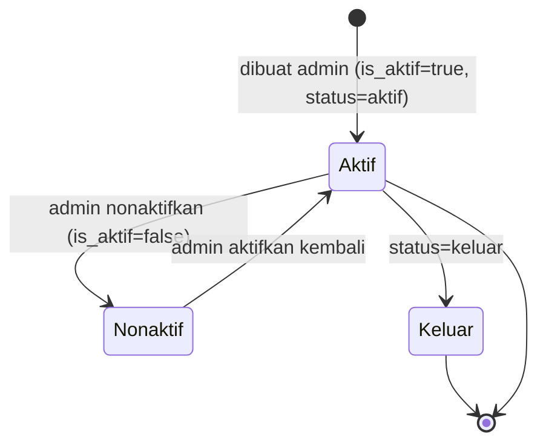
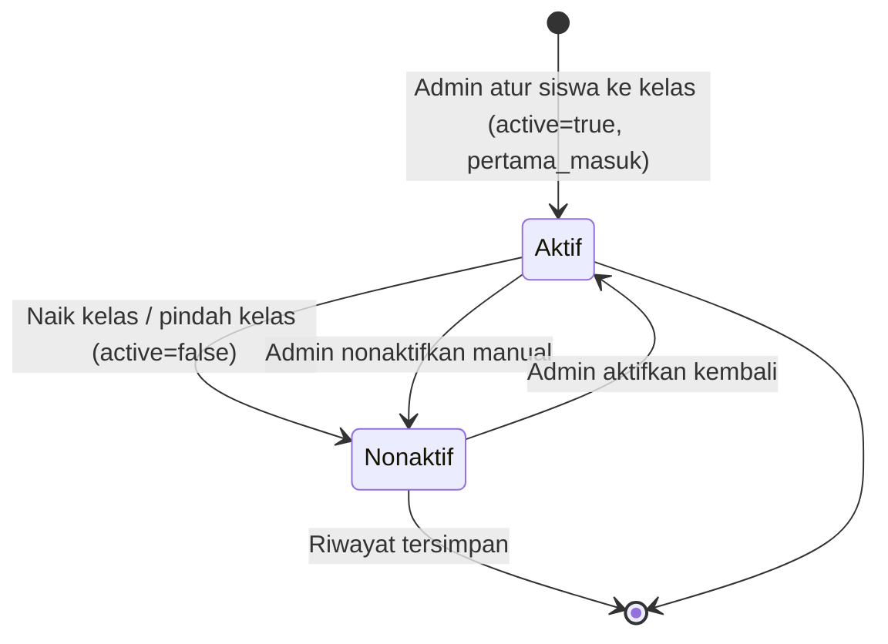
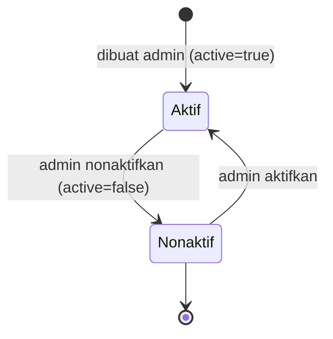
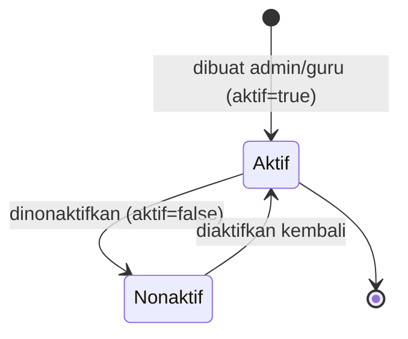
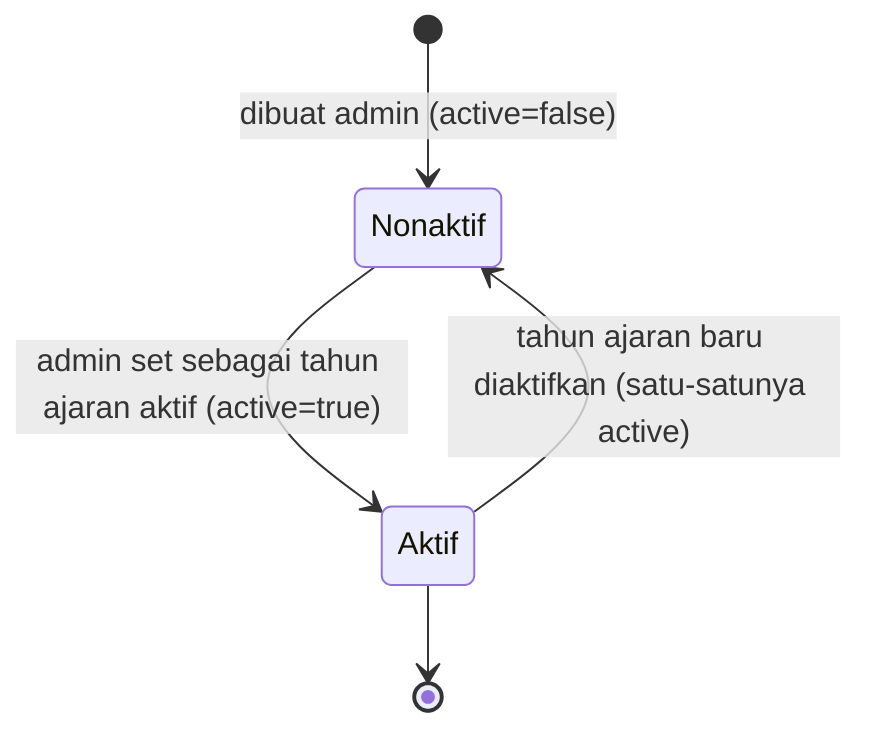
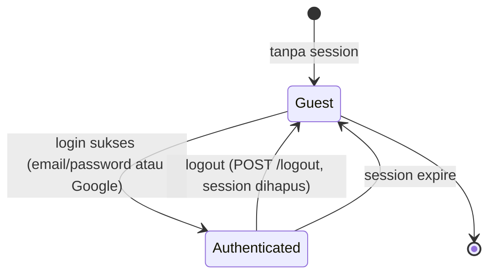
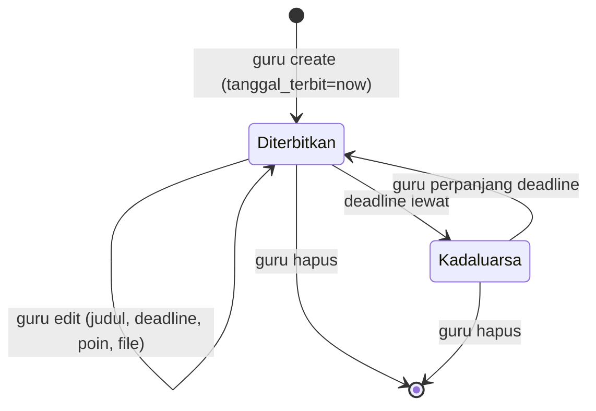
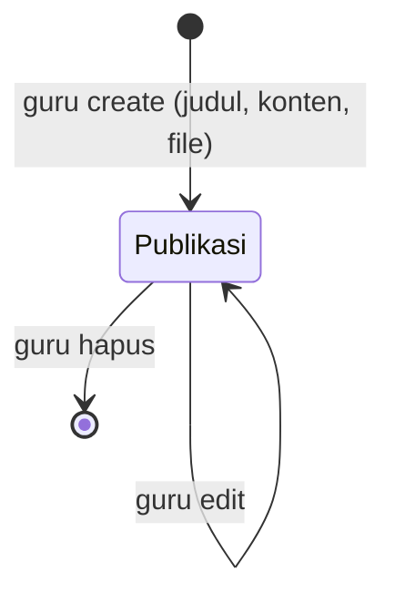

# State Machine Diagram — KELAS DIGITAL IFSU

Diagram state memodelkan siklus hidup objek-objek yang memiliki status. Notasi: Mermaid `stateDiagram-v2`.

## 1. State — TugasPengumpulan (Pengumpulan Tugas Siswa)

Keterangan atribut status: `submitted_at` (waktu terakhir submit), `nilai` (null hingga dinilai guru).

## 2. State — Siswa

Keterangan: kolom `status` pada tabel `siswa` (string) menandai `aktif` / `keluar`; kolom `is_aktif` (boolean) dipakai untuk penyaringan.

## 3. State — SiswaKelas (Keanggotaan Siswa pada Kelas)

Keterangan: relasi historis — satu siswa dapat memiliki banyak `siswa_kelas` untuk tahun ajaran berbeda; hanya yang `active=true` yang tampil sebagai kelas saat ini.

## 4. State — Kelas

Keterangan: kelas induk (tingkat) dan rombongan (parent_id) sama-sama punya status aktif; penugasan & kenaikan kelas hanya memakai kelas aktif.

## 5. State — Penilaian

## 6. State — TahunAjaran

Keterangan: aplikasi memakai tepat satu tahun ajaran aktif sebagai konteks default di seluruh halaman (dishare via `BaseAppController` / Inertia props).

## 7. State — Sesi Autentikasi

Keterangan: middleware `auth` melindungi seluruh route `admin.*` dan `app.*`; `AdminOnly`/`AppOnly` membatasi peran.

## 8. State — Tugas

## 9. State — Materi

