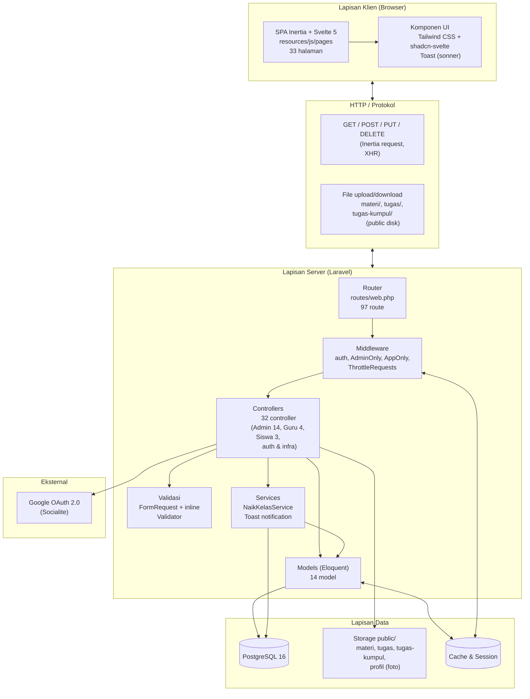
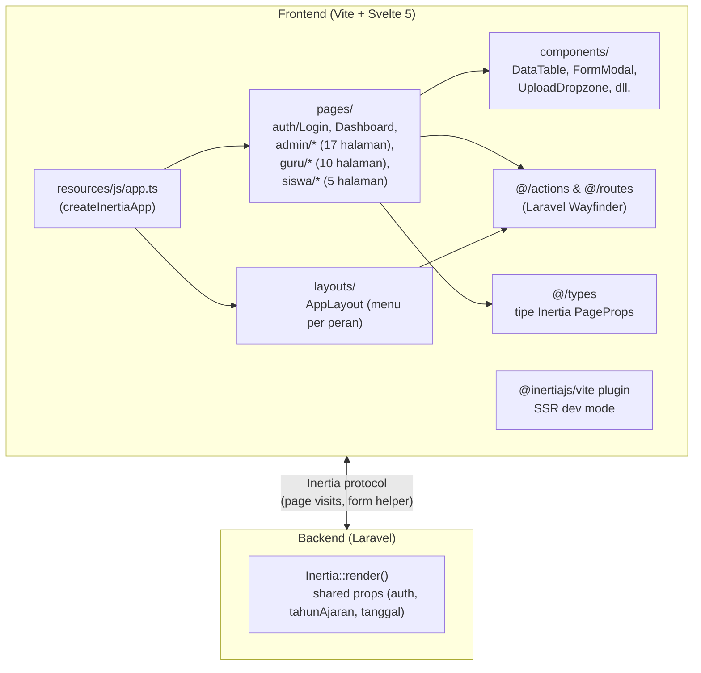
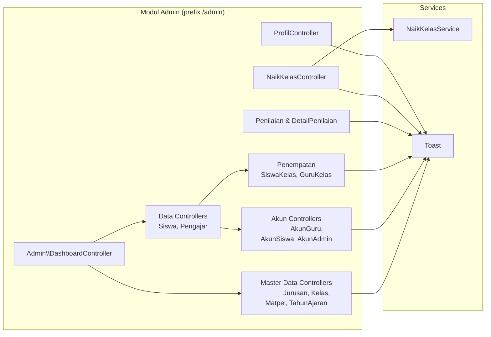
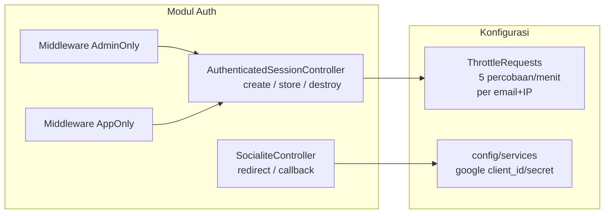

# Component Diagram — KELAS DIGITAL IFSU

Diagram komponen menggambarkan struktur arsitektur aplikasi dan dependensi antar komponen perancah. Notasi: Mermaid `flowchart`.

## 1. Arsitektur Keseluruhan (3-Layer)



## 2. Diagram Komponen — Frontend (Inertia + Svelte)



## 3. Diagram Komponen — Sisi Admin



## 4. Diagram Komponen — Modul Guru & Siswa

```mermaid
flowchart LR
    subgraph Guru["Modul Guru (prefix /app/guru)"]
        GM[Guru\\MateriController]
        GT[Guru\\TugasController]
        GP[Guru\\PenilaianController]
        GD[Guru\\DashboardGuruController]
    end

    subgraph Siswa["Modul Siswa (prefix /app)"]
        SM[Siswa\\MateriController]
        ST[Siswa\\TugasController]
        SP[Siswa\\PenilaianController]
    end

    subgraph Infra["Modul Bersama"]
        MP[MataPelajaranGuruController]
        KC[KelasController (room)]
        LE[LinkExternalController]
    end

    subgraph Files["File Storage (public disk)"]
        DM["materi/ (upload & unduh)"]
        DT["tugas/ (upload & unduh)"]
        DK["tugas-kumpul/ (kumpul & unduh)"]
    end

    GM --> DM
    GT --> DT
    ST --> DK
    GT -.->|nilai| ST
    GP --> SP
```

## 5. Diagram Komponen — Autentikasi



## 6. Tabel Komponen (Peran & Artifact)

| Komponen | Artifact | Teknologi |
|----------|----------|-----------|
| Router | `routes/web.php` | Laravel Router |
| Middleware | `AdminOnly`, `AppOnly`, `auth`, `throttle` | Laravel Middleware |
| Controller Admin | `app/Http/Controllers/Admin/*` (14) | PHP |
| Controller Guru | `app/Http/Controllers/Guru/*` (4) | PHP |
| Controller Siswa | `app/Http/Controllers/Siswa/*` (3) | PHP |
| Service | `NaikKelasService`, `Toast` | PHP |
| Model | `app/Models/*` (14) | Eloquent ORM |
| Halaman Admin | `resources/js/pages/admin/*` (17) | Svelte 5 |
| Halaman Guru | `resources/js/pages/guru/*` (10) | Svelte 5 |
| Halaman Siswa | `resources/js/pages/siswa/*` (5) | Svelte 5 |
| Layout | `resources/js/layouts/*` | Svelte 5 |
| Typed Routes | `resources/js/routes/*` (Wayfinder) | TypeScript |
| Migrasi | `database/migrations/*` (57) | Laravel Migrations |
| Seeder | `database/seeders/*` (8) | PHP |
| Skema DB | `database/schema/pgsql-schema.sql` | PostgreSQL dump |