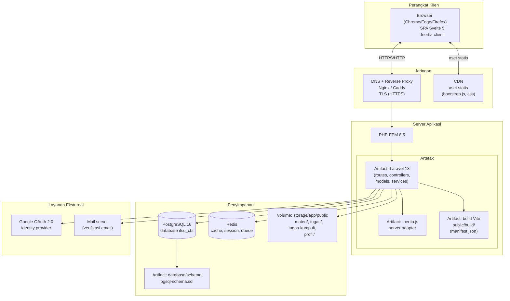
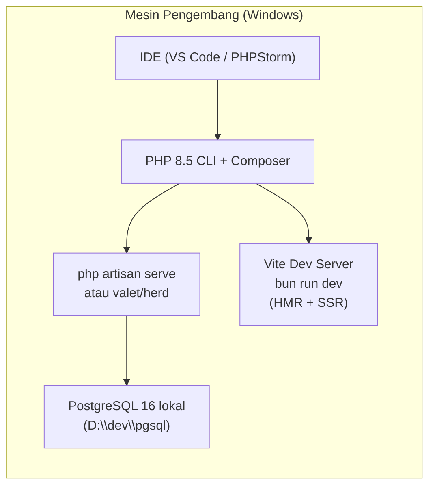
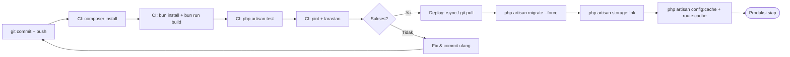

# Deployment Diagram — KELAS DIGITAL IFSU

Diagram deployment menggambarkan topologi infrastruktur ketika aplikasi dijalankan di lingkungan produksi. Notasi: Mermaid `flowchart` dengan `node` untuk perangkat keras, `artifact` untuk artefak, dan `database` untuk penyimpanan.

## 1. Topologi Produksi

## 2. Topologi Pengembangan (Local / Dev)

## 3. Spesifikasi Node

| Node | Tipe | Spesifikasi / Keterangan |
|------|------|--------------------------|
| Browser | Perangkat klien | Browser modern mendukung ES2020+ |
| Reverse Proxy | Jaringan | Nginx/Caddy; TLS; proxy `/` ke PHP-FPM; `public/` sebagai docroot |
| PHP-FPM | Server | PHP 8.5, ekstensi `pdo_pgsql`, `fileinfo`, `mbstring` |
| Laravel | Artefak | Kode sumber + vendor (`composer install --no-dev`) |
| Build Vite | Artefak | Hasil `bun run build`; direferensikan lewat manifest |
| PostgreSQL | Basis data | v16; database `ifsu_cbt`; user app dengan hak CRUD |
| Redis | Penyimpanan | Cache session & rate limiter |
| Storage | Volume | `storage/app/public` di-link ke `public/storage` |
| Google OAuth | Eksternal | Client ID/Secret di `.env` (`services.google`) |

## 4. Alur Rilis (Pipeline)

## 5. Variabel Lingkungan Penting (`.env`)

| Variabel | Keterangan |
|----------|------------|
| `APP_URL` | URL aplikasi (dipakai URL generator & OAuth) |
| `DB_CONNECTION=pgsql` | Koneksi basis data |
| `DB_HOST`, `DB_PORT`, `DB_DATABASE`, `DB_USERNAME`, `DB_PASSWORD` | Kredensial PostgreSQL |
| `GOOGLE_CLIENT_ID`, `GOOGLE_CLIENT_SECRET` | OAuth Google (Socialite) |
| `SESSION_DRIVER`, `CACHE_STORE` | Driver session/cache |
| `FILESYSTEM_DISK=public` | Disk penyimpanan file unggahan |